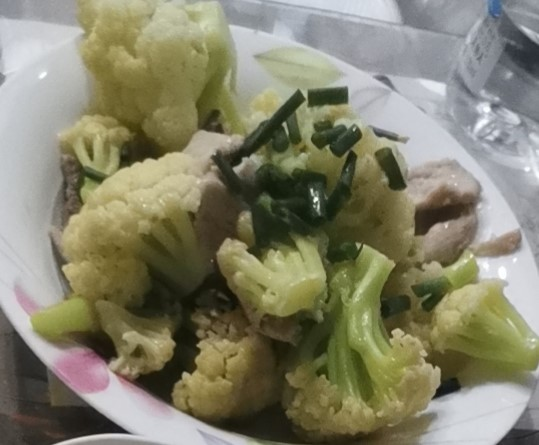
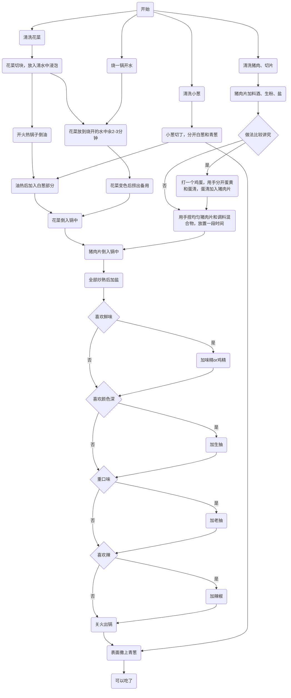

# 花菜肉片的做法

花菜肉片是一道简单易做的菜，荤素搭配。一般初学者只需要 15 分钟 即可完成。

## 必备原料和工具

- 花菜
- 猪肉
- 香葱
- 鸡蛋（可选）

## 计算

每份：

- 花菜 200 克/人
- 猪肉 75 克/人
- 食用油 10-15ml
- 香葱 15 克
- 料酒 3ml
- 盐 3 克
- 生粉 3 克
- 鸡蛋 1 个（可选）

## 操作

- 清洗猪肉，洗去血水，切成厚度 0.3cm 左右的肉片
- 猪肉片中放入 3ml 料酒、1 克盐、3 克生粉
- 如果做法比较讲究，可以打一个鸡蛋，用手分离蛋清和蛋黄，蛋清部分放入猪肉片
- 用手抓匀猪肉片和各种调料的混合物，备用
- 清洗花菜，将花菜切小块，放入清水中浸泡，备用
- 清洗小葱，将小葱切成 0.2cm 长度的丁，分开青葱和白葱部分，备用
- 烧一锅热水，烧开后将花菜倒入，汆 2-3 分钟，待花菜开始变得半透明时捞出，备用
- 热锅，锅内放入 10ml - 15ml 食用油。等待 10 秒让油温升高
- 放入白葱，调中火，等待 10 秒
- 放入汆过的花菜、猪肉片，开大火翻炒 3-5 分钟，直到猪肉片完全变色
- 关小火，加入 2 克盐，口味重的可以加生抽、味精、鸡精、辣椒等各种调料，喜欢颜色深的可以加老抽
- 翻炒 2 下让调味料均匀后关火，盛盘
- 把青葱撒在成品菜表面

## 流程图

## 附加内容

如果您遵循本指南的制作流程而发现有问题或可以改进的流程，请提出 Issue 或 Pull request 。
