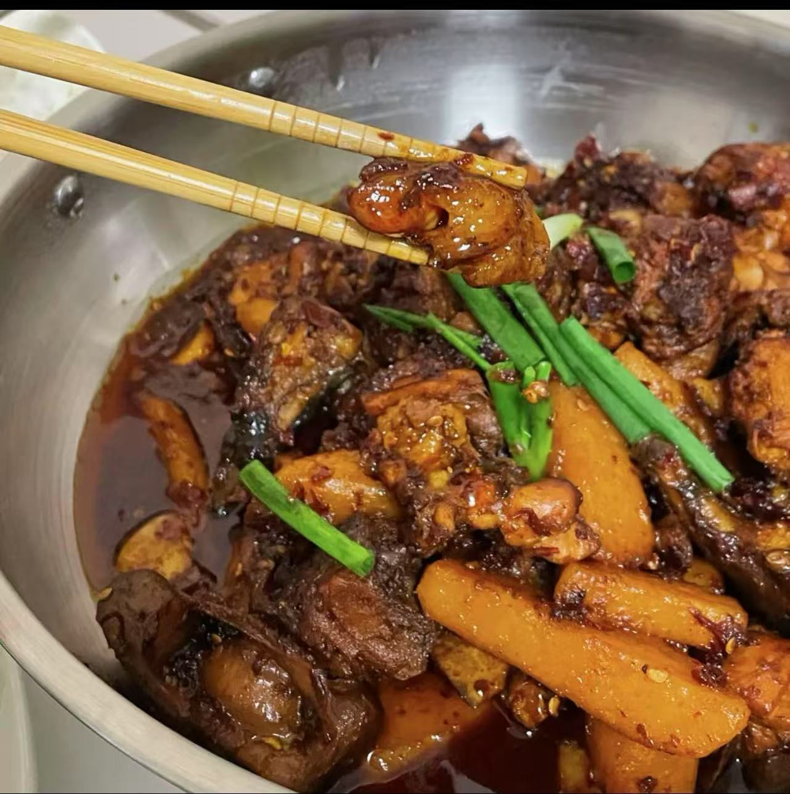

# 贵州辣子鸡的做法

贵州辣子鸡是贵州地区的经典家常菜，以糍粑辣椒和多种香料烹制而成，鸡肉香糯软烂，土豆绵密入味，整体风味香辣浓郁。鸡肉富含优质蛋白质，搭配土豆等配菜，营养均衡。这道菜步骤较多，对新手有一定挑战，但按部就班也能成功。从备料到出锅，预计需要 1.大约 5 小时。

预估烹饪难度：★★★★

预估卡路里：1441 大卡

## 必备原料和工具

- 农村玉米鸡
- 土豆
- 大蒜
- 香叶
- 姜
- 老抽
- 花椒 or 麻椒
- 糍粑辣椒（花溪党武的辣椒，遵义的子弹头，条子椒，大方的皱椒混合之后打碎的辣椒）
- 豆瓣酱
- 啤酒
- 蒜苗
- 酒糟
- 食用油

## 计算

每份：

- 鸡三到四个人的量是四斤，人多可以依次累加
- 啤酒半瓶
- 姜手指头大小两个
- 糍粑辣椒 500g，会是拳头大小两坨
- 蒜苗三根
- 香叶 2 片
- 大蒜两个
- 土豆两个
- 菜籽油两斤，开始炸鸡会用很多
- 老抽 20 ml

## 操作

1. 在锅中加入和锅一半高度的油，将切成长条的土豆先炸至表面金黄然后捞出备用，等油温上至烤手时候将切好的鸡块放入锅中炸，并放入切好的生姜片和花椒
2. 刚开始炸鸡的时候，油是浑浊的，因为鸡块里面有水的原因，等到油炸至清澈，鸡块就炸好了，然后捞出备用
3. 现在锅里面的油可以捞三分之一出来，现在用不到这么多的油
4. 将锅中剩余的油加热，加入糍粑辣椒，豆瓣酱，生姜片，炒出红油状，将炸好的鸡块翻炒均匀
5. 等到鸡块都上色，加入老抽，倒入啤酒，啤酒一定要盖过鸡块，加上香叶盖上盖，闷十分钟，期间间隔翻炒
6. 然后加入土豆条，大蒜（不用切，一颗一颗的最好），然后再闷 20 分钟
7. 最后加入酒糟翻炒均匀再加入切好的蒜苗，就可以出锅了

## 附加内容

- 操作时，需要注意翻炒，因为糍粑辣椒会糊掉

如果您遵循本指南的制作流程而发现有问题或可以改进的流程，请提出 Issue 或 Pull request 。
