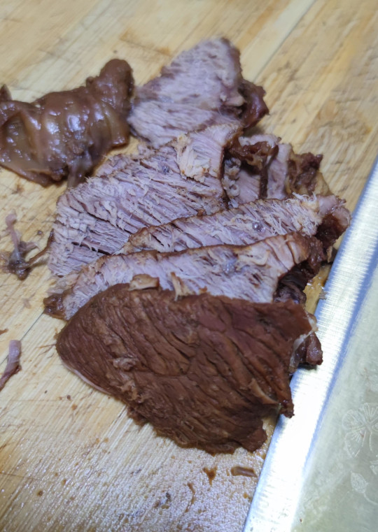

# 家常酱牛肉的做法

酱牛肉营养丰富，味道香，不论是当作主食还是佐餐都很棒。一般初学者只需要 3 小时即可完成。

## 必备原料和工具

- 牛肉
- 香叶
- 姜
- 葱
- 老抽
- 桂皮
- 冰糖
- 花椒
- 料酒
- 生抽
- 盐
- 八角
- 黄豆酱

## 计算

每份：

- 牛肉 2000 克
- 香叶 1 片
- 姜 3 片
- 葱半根
- 老抽 3 勺
- 桂皮 1 块
- 冰糖 7-8 粒
- 花椒 15 粒
- 料酒 6 勺
- 生抽 3 勺
- 盐 8 克
- 八角 4 个
- 黄豆酱 3 勺

## 操作

- 牛肉浸泡 4-6 小时，加料酒、姜片，去除血水
- 牛肉切成 8cm，不超过 10cm 的肉块
- 牛肉放入锅中，加入冷水至水面没过牛肉，开锅至水沸腾开始计时，3 分钟后停火，捞出牛肉，用温水洗净
- 将洗净后的牛肉放入砂锅或炖锅，加水没过牛肉，开大火，放入除盐之外的其他配料。
- 水开之后，大火转为小火，持续加热 90 分钟，加盐
- 加盐后，继续小火 90 分钟（注：每 30 分钟确认水位线，要求至少达到牛肉面高度的 80%）
- 加热 180 分钟后，捞出牛肉，自然冷却，切片
- 上桌食用，其他牛肉建议不切片冷藏。

## 附加内容

- 操作时，需要注意观察沸腾的水位线，如发现低于 2/3 的食材应加热水至没过食材（约每 30 分）。

### 参考资料

- [下厨房app中我的食谱](http://www.xiachufang.com/recipe/106670199/)

如果您遵循本指南的制作流程而发现有问题或可以改进的流程，请提出 Issue 或 Pull request 。
