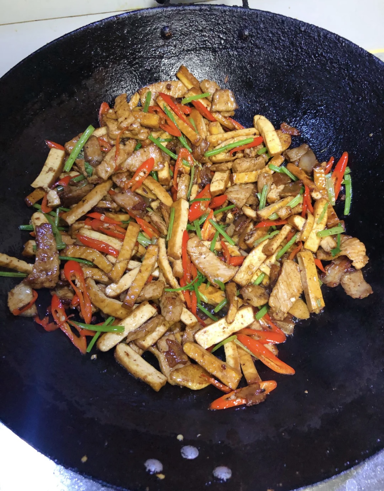

# 香干芹菜炒肉的做法

香干芹菜炒肉是一道非常简单的家常菜小炒，据说多吃芹菜对于高血压有很好的缓解作用，加上香干和猪肉一起翻炒，还是很美味的。一般初学者只需要 30 分钟（含配菜时间）即可完成。

## 必备原料和工具

- 豆干
- 香芹/芹菜
- 猪肉
- 大蒜
- 辣椒：青椒或者红椒都可以
- 花椒：可选
- 盐
- 鸡精：可选
- 老抽
- 蚝油
- 食用油

## 计算

注意，此数值大约是 2 个人的量。

每份：

- 豆干：150g
- 香芹：4 根
- 猪肉：200g
- 蒜头：2 瓣
- 辣椒：4 个
- 花椒：6 粒（不喜欢可以不放，或者放花椒水）
- 盐：5g
- 鸡精：3g
- 老抽：8ml
- 蚝油：5ml
- 食用油：10-15ml

## 操作

- 芹菜去叶切段、切成不超过 4cm 的条状，备用
- 香干切条，宽约小拇指，备用
- 蒜头切片或者剁成蒜泥都行，备用
- 辣椒切圈或者斜切成条都行，备用
- 热锅，锅内放入 10ml - 15ml 食用油。等待 10 秒让油温升高
- 放入花椒、大蒜爆香（可以吃姜的也可以额外放入一些姜片/姜丝）
- 加入猪肉炒至变色，再加入 8ml 老抽上色翻炒均匀（有豆瓣酱的，可以放入 3ml 豆瓣酱一起翻炒）
- 加入香干翻炒均匀（2 分钟左右）
- 加入辣椒翻炒均匀（1-2 分钟左右）
- 加入芹菜，放入 5g 盐翻炒 1 分钟
- 加入 3g 鸡精、5ml 蚝油翻炒均匀，即可出锅

## 附加内容

- 如果没有买到香芹，或者用的芹菜比较粗，可以考虑焯水，放入滚水中 1 分钟捞出，冷水冲洗（保持爽脆）
- 如果买到的豆干比较硬、紧实，也可以切条后再焯水
- [香干芹菜炒肉教程](https://www.xiachufang.com/recipe/105987156/)

如果您遵循本指南的制作流程而发现有问题或可以改进的流程，请提出 Issue 或 Pull request 。
