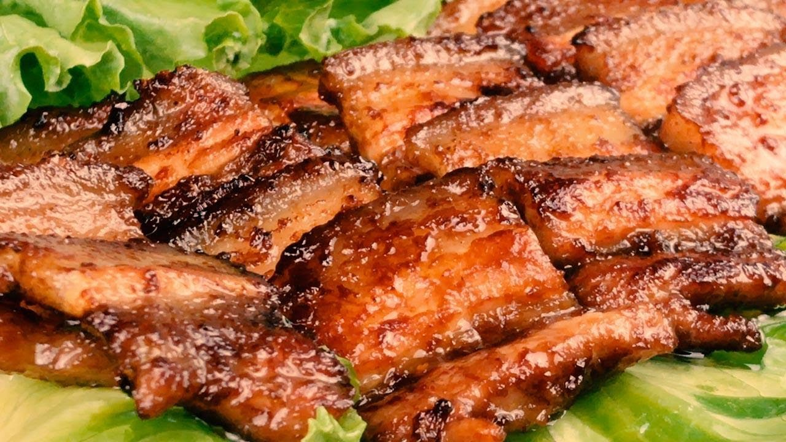

# 香煎五花肉的做法

香煎五花肉一道简单易上手的菜。五花肉肥而不腻，生菜叶脆爽健康。稍微有下厨经验的人半小时便可制作完毕。

预估烹饪难度：★★★

## 必备原料和工具

- 五花肉条（推荐长宽高为 20cm\*6cm\*5cm）
- 生菜
- 酱油，盐，味精，料酒，姜蒜，油，豆瓣酱

## 计算

每次制作前需要确定计划做几份。一份正好够 1 个人吃。

每份：

- 五花肉条（推荐长宽高为 20cm\*6cm\*5cm）
- 生菜一朵
- 食用油 5ml

## 操作

- 将五花肉条沿长边切片，每片厚 1mm-1.5mm，备用
- 将切好的五花肉放置碗中，依次加入 8g 酱油，1g 盐，1g 味精，10g 料酒，两片姜，两朵拍扁的大蒜腌制 10 分钟
- 将生菜叶直接用手扒下来，洗干净，备用
- 热锅，倒入 5ml 食用油。油轻微冒烟后下入五花肉。单面煎制焦黄色后翻面，另一边同理。
- 五花肉出锅后，装盘。
- 将豆瓣酱抹到菜叶上，卷着五花肉即可食用

## 附加内容

- 操作时，小心被溅出的油烫到

如果您遵循本指南的制作流程而发现有问题或可以改进的流程，请提出 Issue 或 Pull request 。
