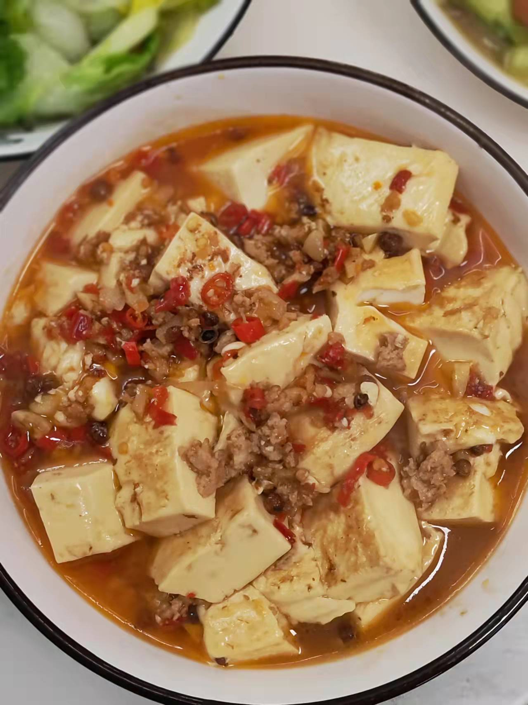

# 麻婆豆腐的做法

这是参考麻婆豆腐创作的一道菜。富含有铁、钙、磷、镁等人体必需的多种微量元素，最重要的是非常下饭哦～

预估烹饪难度：★★★

## 必备原料和工具

- 内脂豆腐（推荐清美）
- 水果刀
- 咸鸭蛋（推荐留夫鸭的，这个是灵魂）
- 五花肉（超市的肉糜也行）
- 大蒜
- 生姜
- 小米椒（不吃辣的可选）
- 香辣酱（推荐广乐的）
- 花椒
- 食盐
- 酱油（味极鲜酱油）

## 计算

- 1 盒内脂豆腐
- 1 枚咸鸭蛋
- 20-30g 五花肉
- 两瓣大蒜
- 2 片生姜
- 5 根小米辣
- 5g 蒜蓉辣酱
- 20 颗花椒
- 3g 食盐
- 10g 酱油

## 操作

- 大蒜和生姜切碎，备用
- 小米辣切成辣椒圈，备用
- 五花肉切成肉糜（本来就是买的肉糜的跳过）
- 肉糜中加入一半的食盐和味极鲜酱油，搅拌均匀，备用
- 鸭蛋用菜刀竖着对半切开（注意安全），去除蛋黄（一定要去除，不然会腥），剩下的蛋白捣碎成大约 2 mm * 2 mm 大小，不用太碎，备用
- 打开豆腐包装，用水果刀将在盒子中的豆腐划成大约 2.5 cm * 3 cm 大小，备用
- 热锅，锅内放入 10ml - 15ml 食用油。等待 10 秒让油温升高
- 调成小火，放入大蒜、生姜、辣椒圈、花椒、咸鸭蛋、蒜蓉辣酱翻炒 20 秒，炒出香味
- 调成中火，放入肉糜，翻炒大约 1 分钟，肉炒变色
- 调成小火，放入豆腐，将剩下的食盐、味极鲜酱油酱油均匀的洒在豆腐上
- 从锅边倒入开水（不然豆腐容易破），没过豆腐即可
- 开大火，水沸腾后立马转入中火，等待大约 10 分钟
- 等到水只剩 1/5 并且豆腐表面已经入色，关火，盛盘

## 附加内容

- 期间一定要主要观察，防止糊锅

如果您遵循本指南的制作流程而发现有问题或可以改进的流程，请提出 Issue 或 Pull request 。
