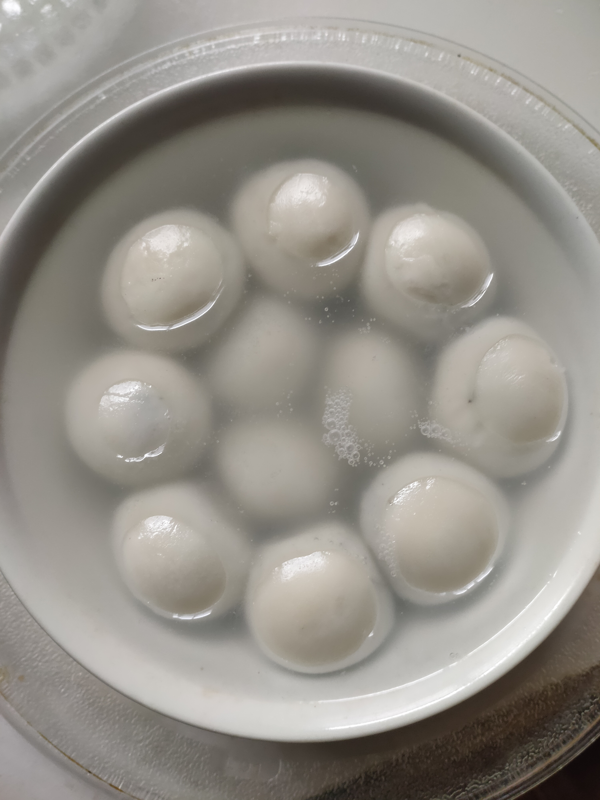

# 速冻汤圆的做法

速冻汤圆是一道简单易做的菜。一般初学者只需要 6 分钟即可完成。

## 必备原料和工具

- 速冻汤圆
- 微波炉

## 计算

每份：

- 速冻汤圆：11 个。数量取决于碗的大小。保证放入的汤圆最高不超过碗高度 - 5mm。

## 操作

- 取出速冻汤圆，放入碗中。
- 倒入开水，直至浸没汤圆。
- 微波炉高火 4 分钟。
- 假如汤圆均已吸水膨胀，则已熟。
- 如果没熟，再加热 1 分钟。

## 附加内容

- 注意先加汤圆再加热水，不要颠倒，不然汤圆倒入热水可能会溅出烫伤。以及无法控制水面高度可能溢出。
- 假如微波炉里碗太烫无法取出，可以用毛巾，或者某些微波炉可以连托盘一起取出。

如果您遵循本指南的制作流程而发现有问题或可以改进的流程，请提出 Issue 或 Pull request 。
