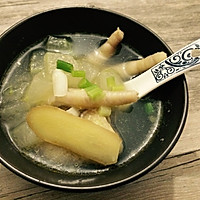
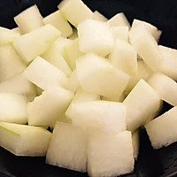
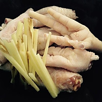

# 冬瓜鸡爪汤的做法

冬瓜鸡爪汤是一道制作简单，营养丰富的家常汤羹，口感清香不油腻。鸡脚富含胶原蛋白和微量元素，冬瓜利尿、清热解暑，还有减肥的功效哦！
这道菜非常适合爱美的美眉哦，爱她就给她来上一碗^^

## 必备原料和工具

* 料酒
* 生姜
* 生葱
* 鸡脚
* 冬瓜
* 枸杞
* 食盐

## 计算
每份：
- 料酒 2匙羹   
- 生姜 5g
- 鸡脚 5~10根(200g)
- 冬瓜 300g
- 枸杞 10~15颗
- 食盐 适量
## 操作
- 将冬瓜去皮、洗净，切不超过5cm大小均匀的丁块状，备用
- 
- 鸡爪清洗干净，剪掉趾甲，备用
- 生姜刮皮，切丝，备用
- 
- 将生葱洗净，摘取葱白部分，将其切成8cm的段备用
- 给鸡爪焯水：锅中放入冷水大约300ml，武火待水沸腾，倒入鸡脚，放入事先准备的姜片和葱白，加适量料酒，去腥增香。
- 电压力锅中放入适量的热水(开水)没过鸡脚即可，按“煲汤”键开始炖鸡爪!
- 酌情加入适量的热水/开水，将冬瓜倒入电压力锅中，同样选择“煲汤”再煲**15 - 20 分钟**(家里有砂煲的小伙伴可以选择用砂煲再煲30分钟) 
- 待冬瓜和鸡脚都烂了之后撒入10~15颗枸杞，盖上锅盖再焖几分钟即可
- 撒点葱花，出锅。一道营养美味的凤爪冬瓜汤就做好了~~~

## 附加内容
- 重要步骤：鸡爪一定要清洗干净，焯水(去除血水和腥味)
- ***入锅加水一定要加热水或者开水，并且水量不宜过多(水位没过鸡脚往上2~3公分的水量即可)，让鸡爪的蛋白质得以充分的释放，煲出来的汤汁才浓、白***
- 冬瓜不宜煲太久，否则全部都溃化了，影响口感和卖相
- 注意控制枸杞的用量，几颗就好！
- 切记不要放味道比较重的调料如：八角、桂皮、胡椒、花椒、香叶、茴香

如果您遵循本指南的制作流程而发现有问题或可以改进的流程，请提出 Issue 或 Pull request 。

