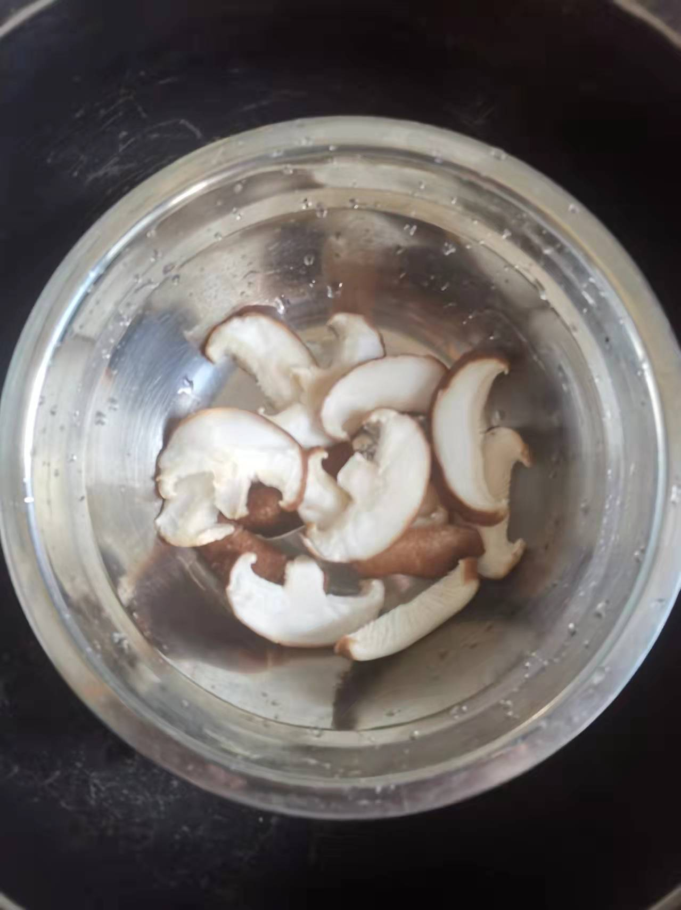
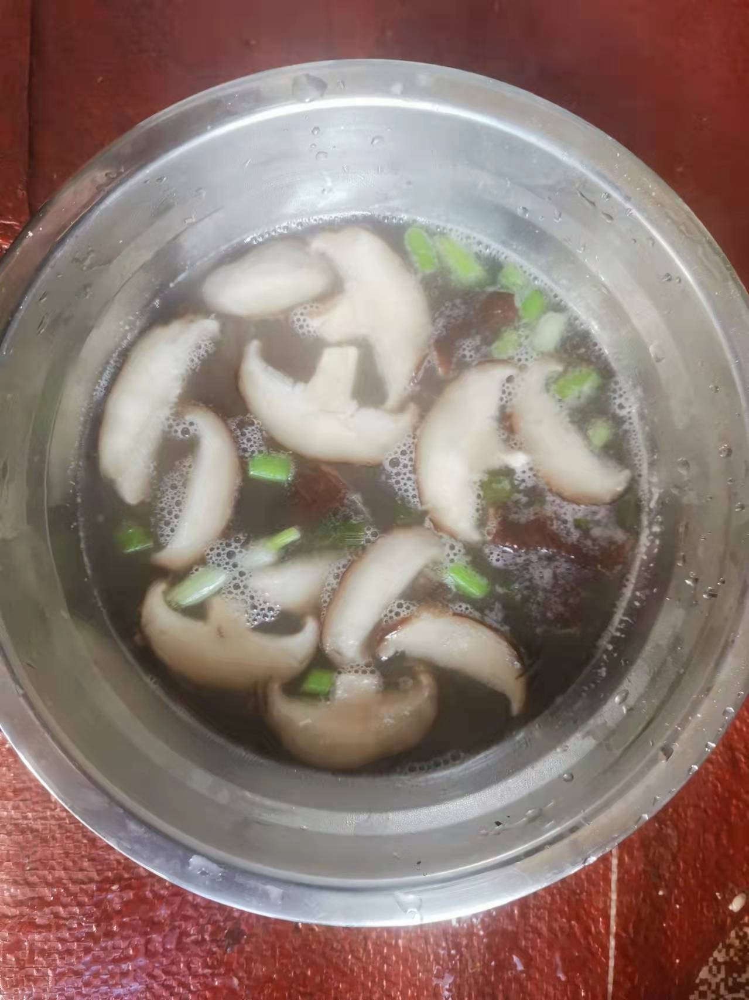

# 勾芡香菇汤的做法

鲜香菇除了拿来和肉炒外，其实拿来做浓浓的勾芡汤也是非常可口的。

## 必备原料和工具

* 香菇
* 香葱
* 食用油
* 食用盐
* 鸡精
* 生粉

## 计算

每人/份：

* 鲜香菇 2朵
* 香葱 半根
* 鸡精 3 g
* 食用油 10 ml
* 食用盐 3 g
* 开水 350 ml
* 生粉 10g

## 操作

* 香菇切片（每片厚度1~2cm,厚点相对薄点更有嚼劲），放入大碗中，倒入2g食用盐 浸泡15分钟
* 生粉倒入小碗中，加入50ml水，搅拌生粉直至融化没有颗粒（即水淀粉）
* 倒掉碗中的盐水，适当去掉香菇本身的水分（方便下一步煎炸）【可选】
* 小火，倒入油，待油开始冒小泡（小火30s左右，看每个锅的功率），倒入香菇，每面煎10s【可选】
* 倒入开水300ml，调中火再煮3~5分钟
* 倒入水淀粉，适当搅拌锅中汤汁后，加入 3g盐、3g ，最后撒上葱花出锅

## 附加内容

如果您遵循本指南的制作流程而发现有问题或可以改进的流程，请提出 Issue 或 Pull request 。
