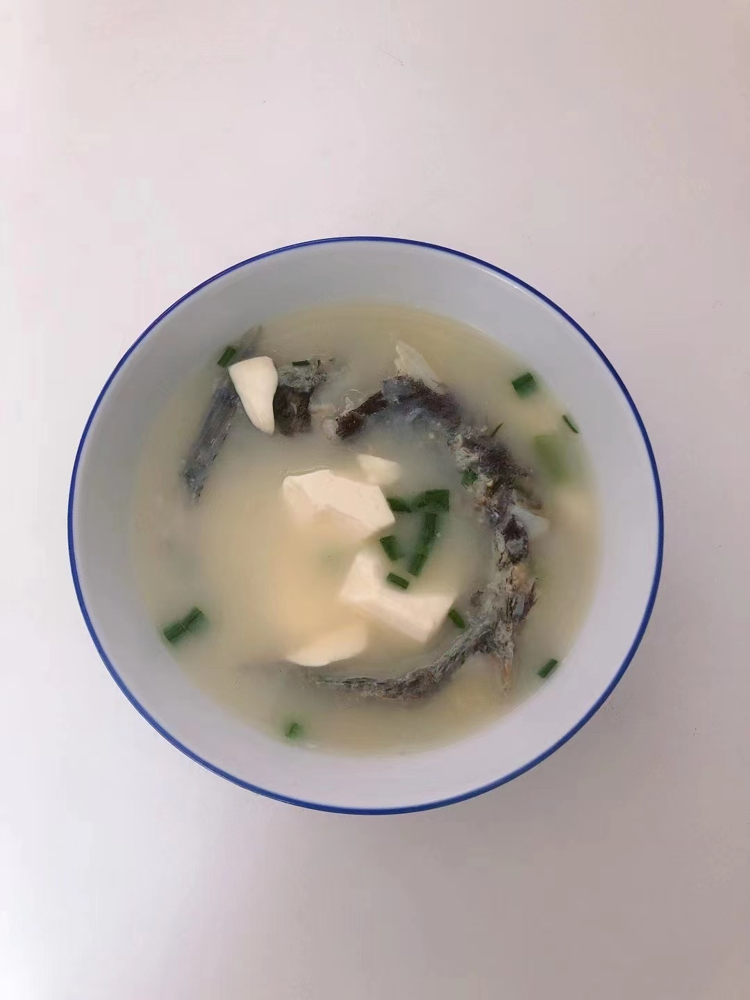

# 昂刺鱼豆腐汤的做法

- 昂刺鱼/沙光鱼 豆腐汤 刺少 肉嫩 营养丰盛、适合任何年龄的小伙伴

## 必备原料和工具

* 昂刺鱼或者沙光鱼
* 豆腐
* 香葱
* 姜
* 食用油
* 料酒
* 食用盐
* 胡椒粉

## 计算

每份：

* 昂刺鱼或者沙光鱼 一条
* 豆腐 100 g
* 香葱 一根
* 姜  一块
* 胡椒粉 3-5 g
* 食用油 15 ml
* 食用盐 10-15 g
* 开水 1L

## 操作

* 鱼处理好后洗净，(特别注意肚内的血丝、不洗干净会有腥味)，放入大碗中，倒入料酒、10g 姜片、5g 盐，腌制 15 分钟
* 豆腐切块，放入凉水浸泡 5 分钟，捞出备用
* 煎鱼前，先用生姜片擦一下锅防止粘锅，倒入油（油量为 15ml * 鱼的条数 ），烧热后放入鱼煎 2~3 分钟，期间需要晃动一下鱼，防止粘底，且需要翻一次身
* 待鱼全部煎好之后，倒入开水、少许料酒、姜片，小火转至大火，盖上锅盖、大火煮 10 分钟左右（水要稍微多一些，后面会蒸发掉一些）
* 见汤变白后倒入准备好的豆腐，调中火再煮 5 分钟，加入 10g 盐、3g 胡椒粉调味，最后撒上葱花出锅

## 附加内容

如果您遵循本指南的制作流程而发现有问题或可以改进的流程，请提出 Issue 或 Pull request 。
