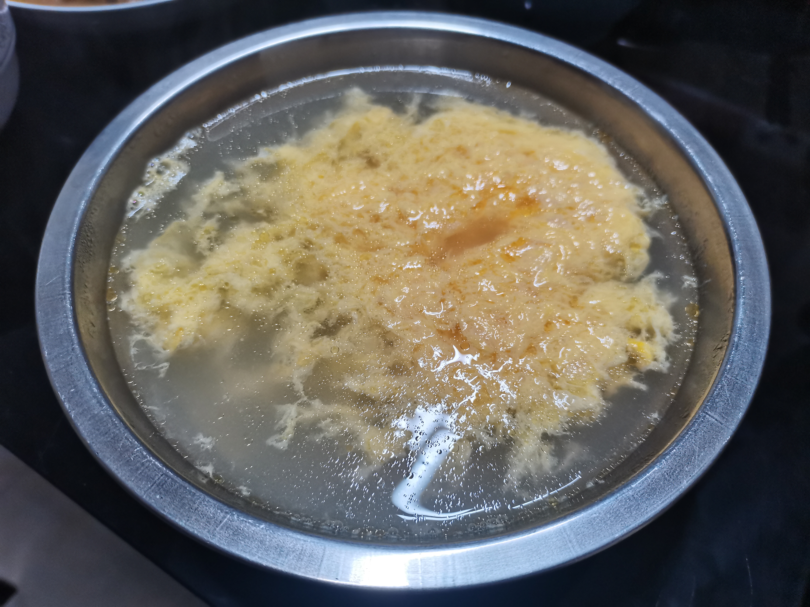

# 朱雀汤的做法

朱雀汤是一道豫东地区的家常快手汤品，口感顺滑香甜，带着芝麻油的醇香。鸡蛋提供优质蛋白质，制作非常简单，只需烧水冲蛋几步就能完成，前后不到十分钟即可上桌，还有清热去火的效果。

预估烹饪难度：★

预估卡路里：168 大卡

## 必备原料和工具

- 鸡蛋
- 香油（芝麻油）
- 白糖
- 水

## 计算

按照 1 人份的份量：

- 一个鸡蛋
- 500ml 水
- 20 克白糖（根据个人口味调整）
- 2ml 香油

## 操作

1. 鸡蛋在碗中打散，再倒入香油。
2. 水烧开后，在沸腾状态下快速倒入盛有鸡蛋的碗中。
3. 放入白糖。

## 附加内容

- 鸡蛋一定要打散，水一定要在沸腾冒泡状态倒入鸡蛋液中，否则汤可能会浑浊影响口感
- 此为豫东地区做法，其他地区有不放白糖放盐的，口味不同，根据个人口味调整
- 此汤乃去火神器！

如果您遵循本指南的制作流程而发现有问题或可以改进的流程，请提出 Issue 或 Pull request 。
