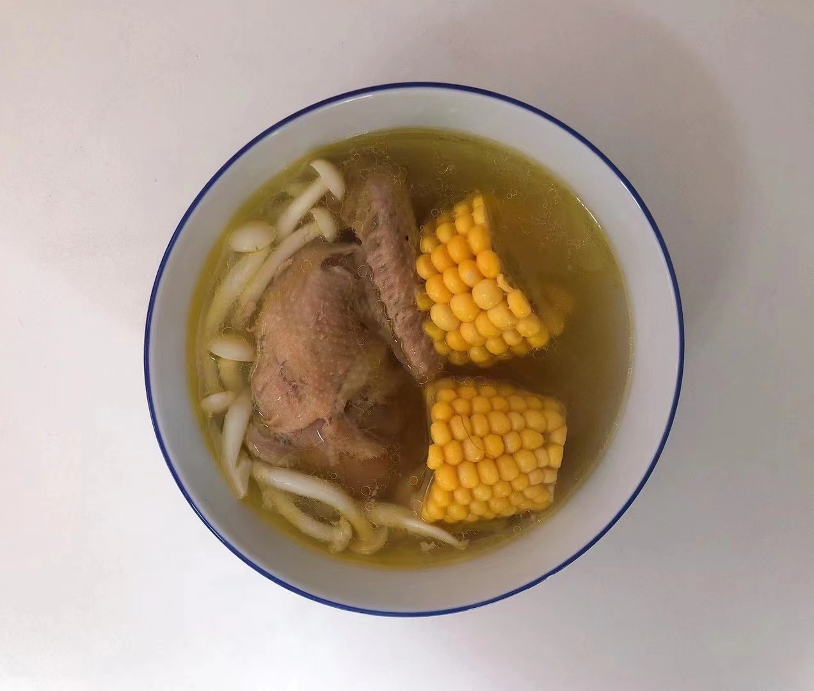

# 菌菇炖乳鸽的做法

- 菌菇炖乳鸽 汤鲜、肉嫩、营养丰富

预估烹饪难度：★★★★

## 必备原料和工具

* 乳鸽
* 菌菇
* 玉米
* 姜
* 料酒
* 食用盐
* 瓦罐或者高压锅

## 计算

2 人份：

* 乳鸽 300 g
* 菌菇 100 g
* 玉米 200 g
* 姜  30 g
* 料酒 15 ml
* 食用盐 10 g

## 操作

* 冷水洗干净热心摊主处理好的乳鸽
* 冷水锅中放入洗干净的乳鸽，加入 15ml 料酒与姜，水煮开即可捞出乳鸽，要不然会丢失营养
* 把乳鸽放到高压缩或者瓦罐中、倒入的水要没过乳鸽，放入生姜 20 g，玉米 200 g、菌菇 100 g

  注意：高压锅 30 分钟，瓦罐需在水烧开后转小火慢炖 40-60 分钟
* 时间到了，盛到碗中，加入 3~5g 盐 即可

## 附加内容

如果您遵循本指南的制作流程而发现有问题或可以改进的流程，请提出 Issue 或 Pull request 。
