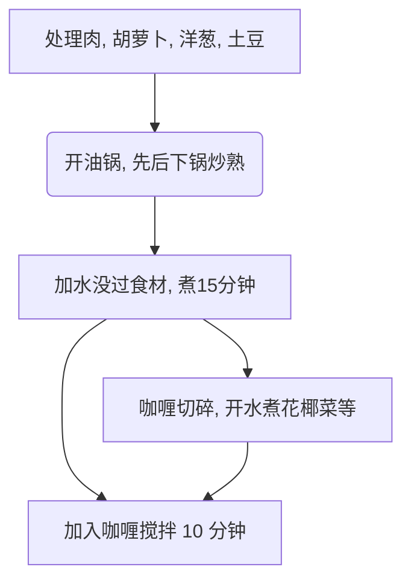
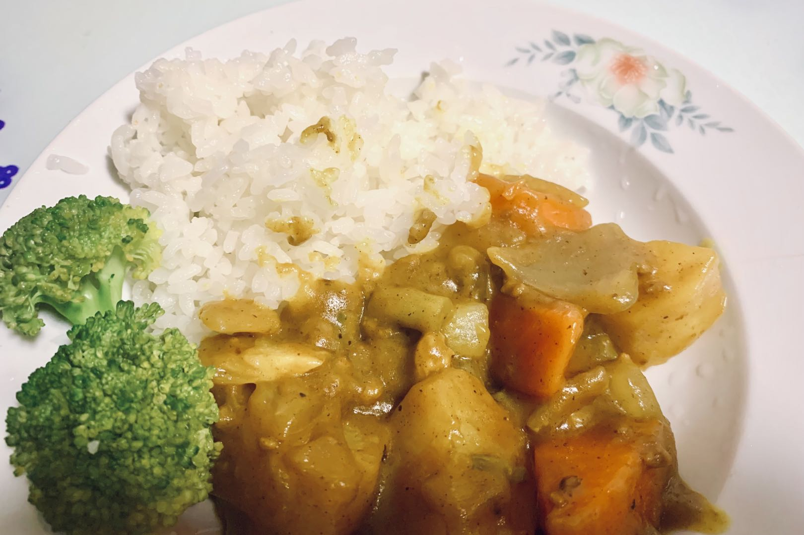

# 日式咖喱饭的做法

## 必备原料和工具

### 主食材

- 咖喱块（推荐品牌好侍）
- 土豆
- 胡萝卜
- 洋葱
- 肉（猪肉、鸡肉、牛肉均可）
- 蒜头

### 副食材

额外用作点缀的食材，可选

- 花椰菜（清水煮开）
- 培根（即食）
- 煎蛋或[太阳蛋](../../breakfast/太阳蛋.md)

## 计算

食材用量与咖喱成正比，计算部分以 **半盒好侍咖喱块（115g）** 为例。半盒约六碗份，做好的咖喱在冰箱冷藏后风味更佳，不用担心一个人吃不完。

- 洋葱 2 个
- 土豆 2 个
- 胡萝卜 1 根
- 蒜头 2~3 瓣
- 肉 2 斤

## 操作

### 1. 食材准备

- 胡萝卜去头尾，去皮，滚刀切
- 洋葱剥去外层去芯，切成月牙状
- 土豆去皮、切大块
- 肉切块状
- 剥蒜拍平切碎
- 咖喱块切碎，增加接触面积加速溶解

### 2. 烧煮过程

- 热油锅放入蒜和肉，**快速翻炒**至肉*表面变白*
- 加入胡萝卜，**快速翻炒**至均匀受热
- 加入洋葱，**快速翻炒**至洋葱*变透明状*
- 加入土豆，保持翻炒至土豆*变软*（可以用筷子确认）
- 加水没过所有食材，沸腾后**等待 15 分钟**
- 关火，加咖喱并搅拌
- 等待咖喱融化后再开火，缓慢**搅拌 10 分钟**，防止糊锅
- 在外观*呈粘稠状态*关火结束制作

### 3.冷藏后加热

冷藏的咖喱每次取出需要吃的份量，加热后盖在[米饭](../米饭.md)上。

- 微波炉：单人份高火 2-3 分钟
- 锅：需额外加 50ml 水，加热时保持搅拌

## 附加内容

### 备注说明

- 步骤 1-6 可以在 2-5 的等待过程进行，在这个过程也可以用清水锅煮些蔬菜，或做个煎蛋。
- 2-5 到 2-6 之间，需要注意观察沸腾的水位线，如发现低于 2/3 的食材应加热水至没过食材。

### 流程图解

### 成品

### 参考资料

- [世界美食教程的微博视频](http://t.cn/EJ77yFy)

---
如果您遵循本指南的制作流程而发现有问题或可以改进的流程，请提出 Issue 或 Pull request 。
