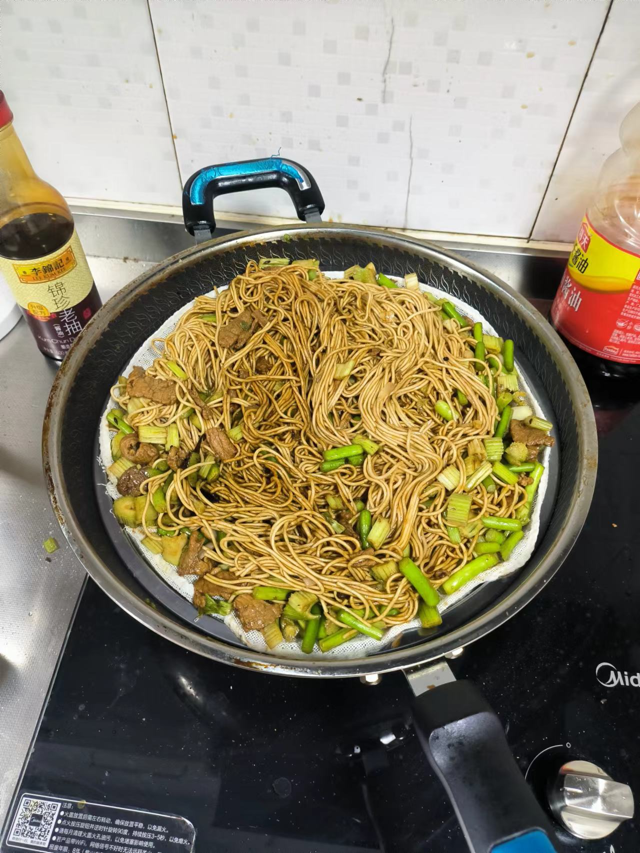

# 河南蒸面条的做法

河南蒸面条是一道在河南坊间流行的小吃，也可以用家里的挂面制作。

简单来讲，是先将挂面裹油放入蒸笼蒸熟，再加蔬菜配以调料炒，最后二次蒸制，以达到入味劲道的效果。

预估烹饪难度：★★★★

## 必备原料和工具

- 挂面 （推荐圆的）
- 五花肉
- 蒜薹
- 葱 + 姜 + 蒜 + 料酒
- 盐 + 鸡精 + 十三香
- 生抽 + 老抽 + 蚝油
- 麻油
- 油 + 锅 + 菜刀 + 铲子
- 蒸篦子
- 额外的盆

## 计算

下面的量是仅仅 1 够一个人一餐的主食的量！请针对实际调整用料的量！

每份：

- 挂面 300g
- 五花肉 350g
- 蒜薹 150g
- 食用油 10-15ml
- 生抽 15ml
- 老抽 10ml
- 蚝油 5ml
- 盐 2g
- 鸡精 2g
- 十三香 1g
- 葱 10g
- 姜 5g
- 蒜 10g
- 料酒 5ml
- 麻油 5ml

## 操作

### 第一次蒸

- 起锅加 7 成水，水开，上蒸篦子
- 将挂面，均匀铺开放置，淋 5ml 油并抹匀，蒸 15 分钟
- 将挂面和蒸篦子取出，放置一边，并倒掉锅中的水

### 切菜

- 五花肉，切成 2mm 厚度的肉片
- 蒜薹，切成 3cm 段
- 葱，切成 0.2cm 薄片
- 姜，切成 1mm x 1mm x 3cm 的细丝
- 蒜，放在砧板上拍碎，切成 1mm 的粒度

### 炒制

- 起锅，烧干水分，加 3ml 食用油
- 手持锅柄，摇晃锅，使食用油充分挂满锅的 2/3
- 中火，加入肉片，翻炒 1 分钟
- 加入葱姜蒜，料酒，继续翻炒 1 分钟
- 将蒜薹段，放入锅中，翻炒 1 分钟
- 开始调味，加入老抽、生抽、蚝油、盐、鸡精、十三香，翻炒 1 分钟
- 加入 500ML 水，没过蔬菜，炖煮 1 分钟
- 将蒸好的挂面放入，不断搅拌 3 分钟，待挂面全部均匀上色，关火
- 将搅拌好的挂面和菜，全部倒入额外的盆中

### 第二次蒸

- 起锅，加冷水 7 成，放上蒸篦子，将拌好的面条和菜，均匀的铺在上面
- 水开后，大火烧 15 分钟，出锅
- 淋上 10g 的麻油，即可食用

## 附加内容

挂面的粗细与口感：

- 细的、圆的 （超市大部分都是这种，口感更加劲道）
- 宽的、扁的 （口感比较软）

如果您遵循本指南的制作流程而发现有问题或可以改进的流程，请提出 Issue 或 Pull request 。
