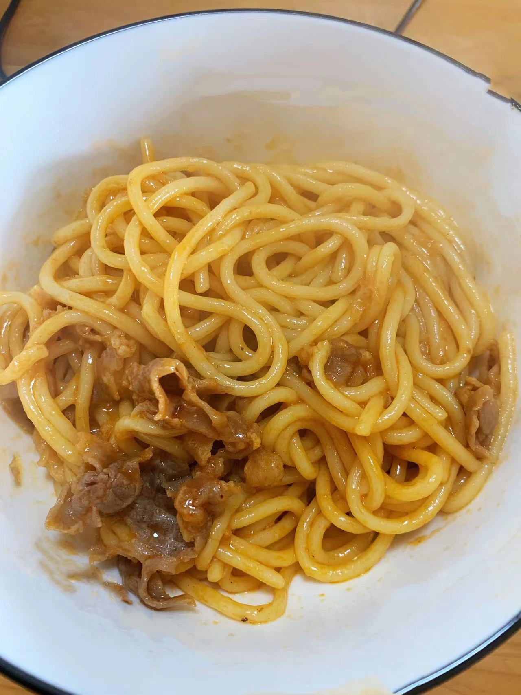

# 炒意大利面的做法

这是一道软糯爽口的意大利面的做法，非常简单，用时大概30分钟。

## 必备原料和工具

- 意大利面
- 肥牛片
- 番茄酱 / 黑胡椒酱（选其一即可）
- 菜籽油（其他植物油也可）

## 计算

- 意大利面50克 / 人
- 肥牛5片 / 人
- 食用油5ml / 50克意面

## 操作

- 加入250克水 / 人
- 待水烧开，下入面条，中火煮15 - 20分钟（这个面通常比较硬，捞起来之前最好尝一下，中心如果有一点硬，需要继续煮）
- 捞出面条，盛入盘中备用
- 热锅倒入食用油，待油温中热，下入面条翻炒一分钟（如果太干，加入少量水）
- 放入10克番茄酱、肥牛、加入少许食盐，继续翻炒一分钟
- 起锅
