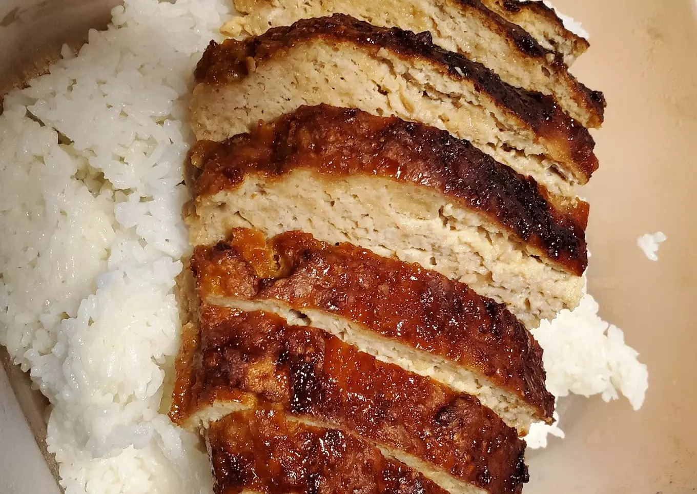

# 空气炸锅照烧鸡饭的做法

空气炸锅照烧鸡饭是一道简单易做的菜。是一道既便利又便宜的美食，而且在品尝美味的同时，新手也能完全掌握！

## 必备原料和工具

- 丽滋饼干(Ritz crackers)
- 酱油
- 糖（白沙糖）

## 计算

每次制作前需要确定计划做几份。一份正好够 1 个人吃。

每份：

- 鸡肉 900g
- 酱油 100-125ml
- 糖 60-65g
- 白醋 30-35ml
- 丽滋饼干（咸味曲奇可替代） 16 个(48g)
- 鸡蛋 2 个

## 操作

- 将酱油、糖和醋混合在一起,搅匀料汁备用
- 另一个碗中加入鸡肉、鸡蛋、1/2 料汁和压碎的丽滋饼干。搅拌均匀
- 空气炸锅用箔纸碗铺底，加入肉饼混合物，将剩余的料汁均匀的倒在上面
- **350°** 炸**40 分钟**。最好在米饭上食用<!-- 在描述过程时不得加入上文或原材料中未提及的食材。 -->
- 在外观*呈金黄酥脆*后出锅，切块盛盘

## 附加内容

- 操作时，需要注意温度以免烫伤。
- 参考资料：[库克美食教程](https://cookpad.com/)

如果您遵循本指南的制作流程而发现有问题或可以改进的流程，请提出 Issue 或 Pull request 。
