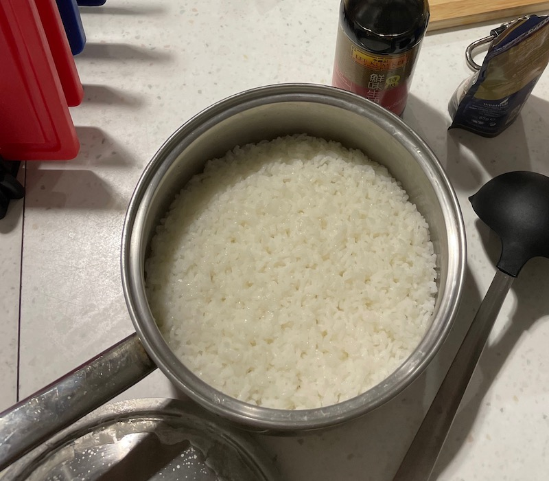

# 米饭的做法

您可以使用[电饭煲](#使用电饭煲蒸米饭)或[普通煮锅](#使用普通煮锅蒸米饭)制作米饭。

## 使用电饭煲蒸米饭

### 必备原料和工具

* 电饭煲
* 江南米或北方大米
* 水

### 计算

* 每人可以食用 100ml-200ml 的米。

指尖量水法 （用于精准确定米水量的方法）

* 江南米，米和水放在电饭煲的容器内，食指触及米时，水量能刚好没过食指的第一个指节的**一半的一半**。
* 北方大米，米和水放在电饭煲的容器内，食指触及米，水量能刚好没过食指的第一个指节。

使用上述条件，计算出计划使用的原材料比例。

### 操作

* 清洗米
* 将米和水一起加入电饭煲中。
* 连接电饭煲电源，进入加热模式。等待大约 30 分钟。
* 待电饭煲自动进入保温模式后。
* 将米在电饭煲中闷 10-15 分钟。
* 盛出米。

### 附加内容

* 技术总结
  - 不论什么容器，水的量都是可以使用“指尖量水法”煮出好米饭。
  - 水的多少是能够严重影响一碗好米饭的口感。
  - 南方一般食用江南米，北方一般食用北方大米，江南米会比较细长，而北方大米会比较短且圆。
  - 米饭不同品种的米，不同的水量会极度影响口感。
- 更多信息请参考使用的电饭煲的说明书。

## 使用普通煮锅蒸米饭

### 必备的原料和工具

- 北方大米
- 水
- 厚底煮锅+严丝合缝的锅盖（制作过程中不会有大量蒸汽泄漏）

### 计算

- 米： 100ml-200ml/人
- 水： 米的体积的 2 倍

### 操作

- 清洗大米
- 将米和水加入煮锅
- 大火煮至水沸腾
- **搅拌底部防止粘黏**
- 盖上锅盖，转**小火**加热 10-15 分钟（根据对软糯程度的喜好），中途切勿打开锅盖
- 关火，静置 5 分钟
- Enjoy :)

### 参考

[腐国人研究煮米饭，好想送他们个电饭煲！](https://www.bilibili.com/video/BV1RW411z7r9)

---

如果您遵循本指南的制作流程而发现有问题或可以改进的流程，请提出 Issue 或 Pull request 。
