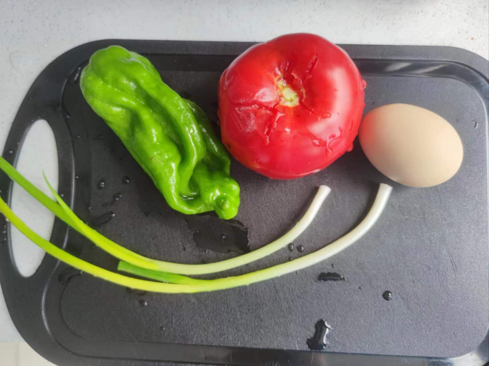
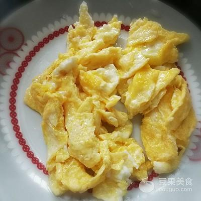
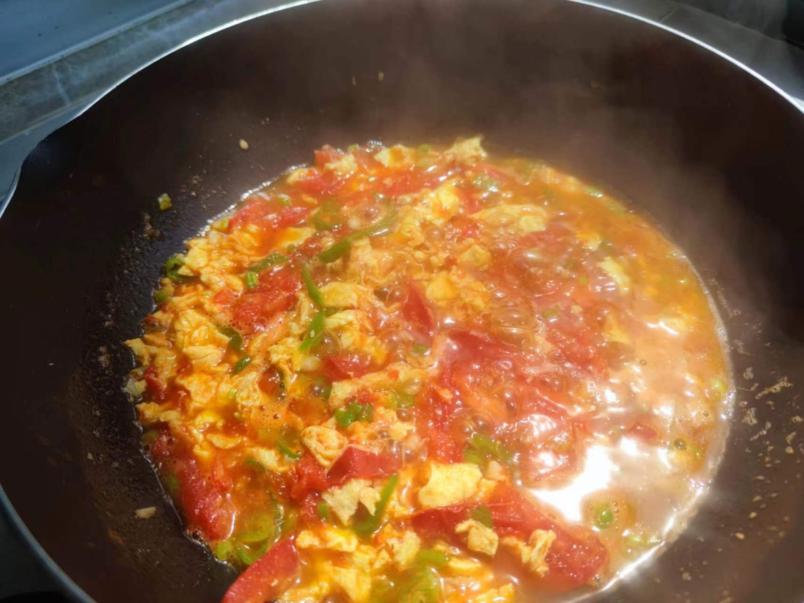
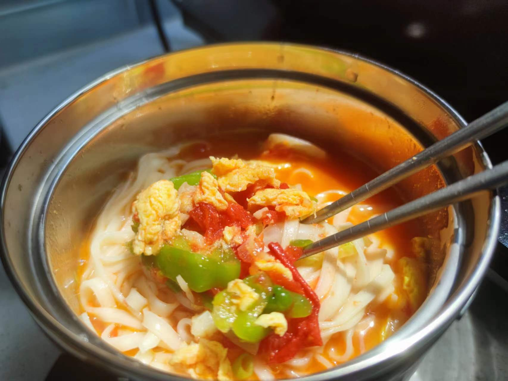

# 西红柿鸡蛋挂面的做法

挂面太多怎么办？只煮个白水面味道难以下咽怎么办？简单的食材煮个美味的面条怎么操作？
西红柿鸡蛋挂面只需简单的食材，快速的操作，不多的厨具，解决**不想麻烦**、**挂面太多**、**食材简单**的所有烦恼
此处更要鸣谢 my mother 的在线指导:v:
简单好做，开始吧！
制作时间：20 分钟

预估烹饪难度：★★

## 必备原料和工具

- 挂面或者鲜面条也行
- 西红柿一个
- 盐
- 鸡蛋
- 葱
- 酱油、蚝油或者鸡精
- 白砂糖（中和西红柿的酸味，西红柿如果不酸就不用加）
- 青椒（非线椒）
- 香油

## 计算

每次制作前需要确定计划做几份。如下分量正好够 1 个人食用

总量：

- 挂面 1 把（根据食量来）50-100g
- 西红柿 1 个大概 200g 吧。
- 鸡蛋 1~2 个
- 盐 5g
- 蚝油 5g 或鸡精 3g
- 白砂糖 2g
- 酱油 5-8g
- 食用油的用量为 20g
- 香油 5g

## 操作

### 食材的预处理

食材预处理很重要，无论做什么菜提前进行处理，在菜肴制作过程中才不会慌乱，并且制作是个很舒心的过程，这……可能就是为什么后厨需要一个单独的打荷岗位吧

- 小葱洗净并切成葱花
- 西红柿切块儿，如果不太会切建议先百度一下~
- 青椒切成菱形块
- 生鸡蛋打入一个小碗并打散，如果鸡蛋有点腥味可以加 2g 白醋去腥

### 鸡蛋的预处理

- 起锅烧热，倒入 15~20g 食用油，鸡蛋炒嫩滑就得多一点油，同时为后面煸炒西红柿留一些底油
- 待油温到七成热时（手掌隔大概 10cm，能感觉到热），倒入蛋液快速划散
- 鸡蛋滑到凝固后，一点不会有蛋液了后倒入小碗备用，此处留一些底油

> 鸡蛋没有拍照用网图来代替吧

### 制作西红柿鸡蛋臊子

- 锅中留底油后先加入葱白、蒜末炒香
- 加入西红柿块、青椒，待西红柿炒出一点汁水
- 此时速速加入 5g 酱油和 2g 白砂糖
- 翻炒十几秒后加入一碗清水（刚刚好即将没过西红柿即可）
- 煮沸后加入炒好的鸡蛋，加入蚝油 5g 或者 2g 鸡精用于提鲜
- 中小火收汁，期间要搅拌防止粘锅，收汁到下图后加一点葱花（剩下的葱绿部分）和香油（不加也可以），臊子制作完成

### 最后煮面条

- 可以不用洗锅，直接加清水 500ml
- 煮沸加入挂面，挂面煮软后加入 100ml 清水
- 再次煮沸后，若面条飘起来了，再加入 100ml 清水
- 煮沸后看面条两侧是否呈透明状，透明状则熟了
- 捞面到臊子碗中，拌面即可啦~

## 附加内容

- 鸡蛋蛋液中可以加入 2g 黑胡椒味道更好
- 熬臊子过程中加入 2g 白胡椒粉提升香辛口味
- 煮面条如果一次性煮熟也可以，多次加水是为了让面条口感劲道，面条不粘黏，技巧在于煮沸就加冷水，循环往复两三次即可

如果您遵循本指南的制作流程而发现有问题或可以改进的流程，请提出 Issue 或 Pull request 。
