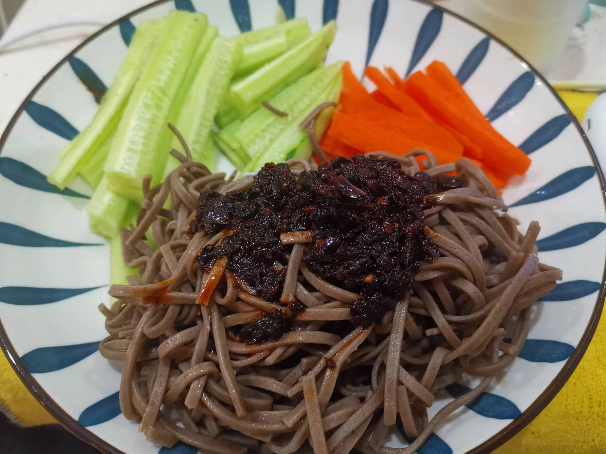
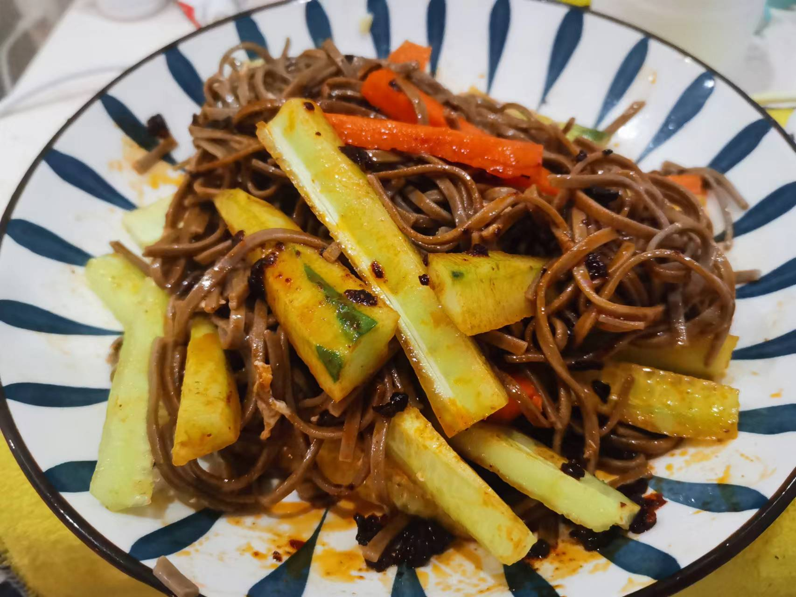

# 酱拌荞麦面的做法

酱拌荞麦面营养健康、酸甜可口

预估烹饪难度：★★

## 必备原料和工具

* 荞麦面
* 黄瓜
* 红萝卜
* 老干妈

## 计算

每份：

* 荞麦面 100 g
* 黄瓜 0.5 根
* 红萝卜 0.5 根
* 老干妈 20 ml

## 操作

* 荞麦面下冷水煮熟，8-10 分钟 后捞出沥干备用
* 黄瓜、萝卜 切成小条
* 将荞麦面、黄瓜、萝卜放入盘子，放上老干妈，搅拌

## 附加内容

* 荞麦面沥干后可以放冰箱冰镇后口感更佳
* 配料可以根据个人喜好选择其他，例如虾仁、肉沫等
* 酱料可以根据个人喜欢选择其他，例如花生酱、芝麻酱等
* 荞麦面跟其他面条热量几乎一致，所以不适合作为减脂的主食

如果您遵循本指南的制作流程而发现有问题或可以改进的流程，请提出 Issue 或 Pull request 。
