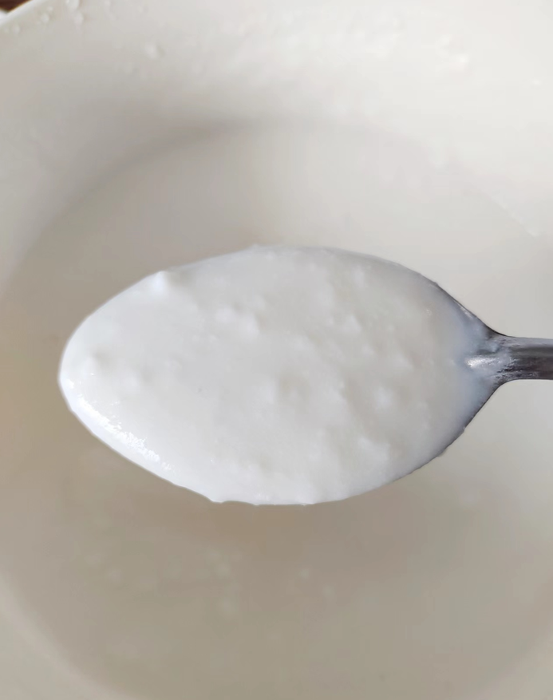

# 冷藏蜂蜜酸奶的做法

蜂蜜配酸奶有润肠通便、增强人体免疫力、美容养颜等功效，经常食用酸奶加蜂蜜，可以减少癌症的出现，还能够控制癌细胞的再生与扩散。而且很美味哈~

难度：简单

时常：自制酸奶的话12h左右，现成酸奶的话2h即可

## 必备原料和工具

- 酸奶（可自制，牛奶+酸奶+酸奶机）
- 蜂蜜
- 冰箱

## 计算

每次制作前需要确定计划做几份。一份正好够 2 个人吃。

每份：

- 酸奶500ml（或者自制：牛奶450ml+酸奶50ml+酸奶机）
- 蜂蜜20g

## 操作

- **方法一：自制酸奶**
  - 将牛奶450ml+酸奶50ml放入酸奶机的容器中
  - 将酸奶机接通电源等待8-12h
  - 查看酸奶是否发酵完成（如未完全发酵可增加发酵时间，最长应不超过12h）
  - 将发酵好的酸奶放入20g蜂蜜
  - 将兑好的蜂蜜酸奶放入冰箱冷藏2h
  - 完成！
- **方法二：购买酸奶**
  - 将酸奶放入20g蜂蜜
  - 将兑好的蜂蜜酸奶放入冰箱冷藏2h
  - 完成！

## 附加内容

- 酸奶可直接使用乳酸菌代替
- 冷藏即可，不宜冷冻哦
- 可以加西瓜、葡萄等水果

如果您遵循本指南的制作流程而发现有问题或可以改进的流程，请提出 Issue 或 Pull request 。

