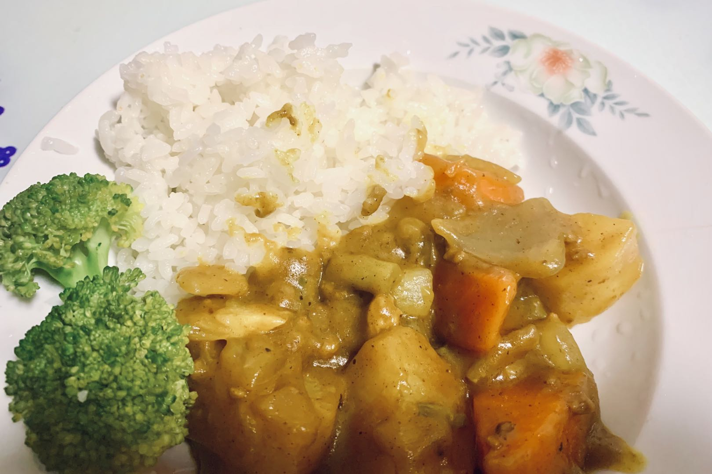

<!-- 这是 HowToCook 菜谱仓库中的示例菜谱模板文件。 -->
<!-- 注意：在编写时，中文与英文或数字之间必须有且仅有一个空格。 -->
<!-- 注意：在编写时，标题与正文之间必须有且仅有一个空行。 -->

# 示例菜的做法

<!-- 标题必须是 `菜名` + `的做法`。和文件名一致。 -->

<!-- 如果有图片更好。 -->

<!-- 在这里简单介绍菜的特点、营养价值、难度、预计制作时长。 -->
示例菜是一道简单易做的菜。富含 DHA 和蛋白质。一般初学者只需要 3 小时即可完成。还有美容效果哦~

<!--
1星：没有特别困难的步骤。只需要将原材料简单混合烹饪即可。大约5分钟即可完成。即使没有做饭经验的人，也可以按照步骤做出像模像样的效果。
2星：包含的步骤非常简单。不太需要烹饪经验，只需要按照步骤进行操作即可。大约10分钟即可完成。即使没有做饭经验的人，也可以按照步骤做出像模像样的效果，但是想要做出完美的效果就需要一定的练习。
3星：包含的步骤不算太复杂。需要一定烹饪经验，能够熟练掌握火候、时间、材料组合的技巧。大约15分钟即可完成。对于有经验的厨师，并不会太难，但是想要做出完美的效果也需要一定的经验加上练习。
4星：包含了很多复杂的步骤。需要精妙的掌握火候、时间、材料组合的技巧。40分钟以内即可完成。即使是有经验的厨师，也需要花费很多时间来准备这道菜，但是做熟练之后，就可以做出非常美味的效果。
5星：包含了很多复杂的步骤。需要精妙的掌握火候、时间、材料组合的技巧。可能需要40分钟以上才能完成。即使是有经验的厨师，也需要花费很多时间来准备这道菜，并且非常容易出现失误。
-->

预估烹饪难度：★★★★

## 必备原料和工具

<!-- 在这里列出必需原料。以方便大家快速判断自己手边的材料是否足够。-->

<!-- 注意：某些原料已经在厨房采购部分提及。这里不要重复提及： -->
<!-- 燃气灶, 饮用水, 锅, 食用油, 碗与盘子, 筷子, 炒勺, 洗涤剂, 抹布, 钢丝球, 菜刀 -->

<!-- 可以推荐购买哪个品牌的来方便决策。 -->

- 咖喱块（推荐品牌好侍）
- 土豆
- 藤椒油（可选）

## 计算

<!-- 这一章节里介绍一些计算公式，求得原料的量、重要的时间参数、混合比例，以便在后续操作中引用。 -->

<!-- 这里有两种情况： -->
<!-- 1. 可能会大批量做菜。例如：食堂给全校学生做西红柿鸡蛋、米饭、米粥。这种情况需要给出计算公式。 -->
<!-- 2. 固定菜量的产品菜。每份的容量一致而永远不会发生变化。这种情况需要给出一份的量。 -->

每次制作前需要确定计划做几份。一份正好够 2 个人吃。

每份：

<!-- 对于大小不一的食材，必须给出质量参考 -->
<!-- 对于可以自行斟酌加量的食材，必须给出建议添加的范围 -->
<!-- 请不要使用有大有小的容器作为单位！这会令人困惑，难以后续精准化。请使用毫升！ -->

- 咖喱块 115g
- 土豆 2 个（每个土豆大约重 120g，共约 240g）
- 食用油 10-15ml

## 操作

<!-- 在这里详细描述做菜的全部流程。 -->
<!-- 不允许使用不精准描述的词汇，例如：`适 量`、`少 量`、`中 量`、`适 当`。 -->
<!-- 在这里，如果操作的食材不是“全部食材”而是“部分食材”，也必须指明。否则默认指定的是全部原料。例如这里‘土豆’表示‘全部准备好的土豆’。 -->

- 土豆去皮、切成不超过 4cm 的大块，备用
- 咖喱块切碎，增加接触面积加速溶解，备用
- 热锅，锅内放入 10ml - 15ml 食用油。等待 10 秒让油温升高
- 放入土豆，保持翻炒至土豆*变软*（可以用筷子确认）<!-- 在描述过程时不得加入上文或原材料中未提及的食材。 -->
- 加水没过所有食材，沸腾后，将火调小然后**等待 15 - 20 分钟** <!-- 对于可以自行斟酌加量的食材，必须给出建议的范围 -->
- 关火，加咖喱并搅拌，等待直至咖喱融化 <!-- 凡是需要等待的步骤必须给出`等待时间计算公式`或`结束一个步骤的判断标准` -->
- 再开火，缓慢**搅拌 10 分钟**，防止糊锅
- 在外观*呈粘稠状态*后关火，盛盘

## 附加内容

<!-- 在这里额外补充一些注意事项、参考资料、安全须知等。 -->

- 操作时，需要注意观察沸腾的水位线，如发现低于 2/3 的食材应加热水至没过食材。
- 参考资料：[世界美食教程的微博视频](http://t.cn/EJ77yFy)

<!-- 必须保留下面的文字。 -->
如果您遵循本指南的制作流程而发现有问题或可以改进的流程，请提出 Issue 或 Pull request 。

<!-- 在提交 Pull Request 前，请删除模板中的所有注释。 -->
