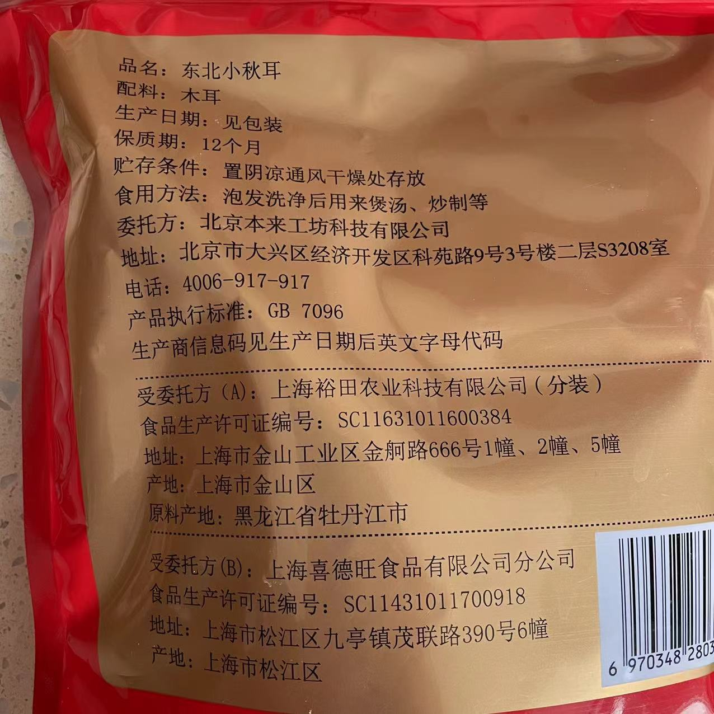
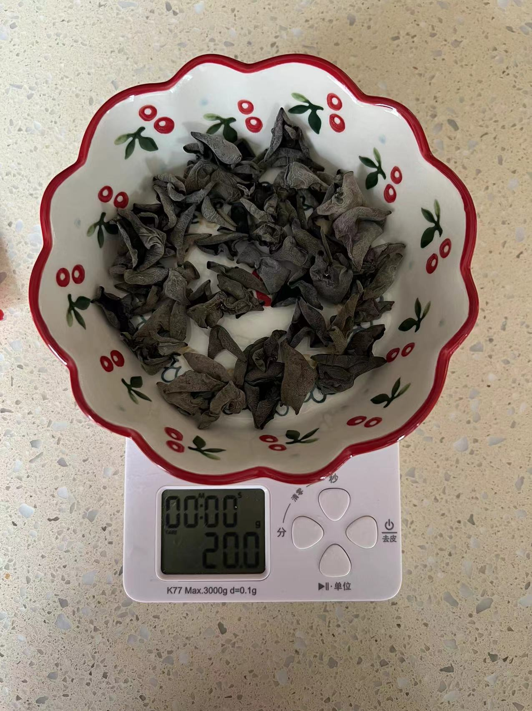
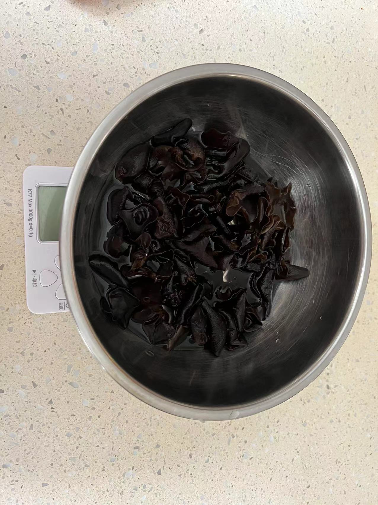
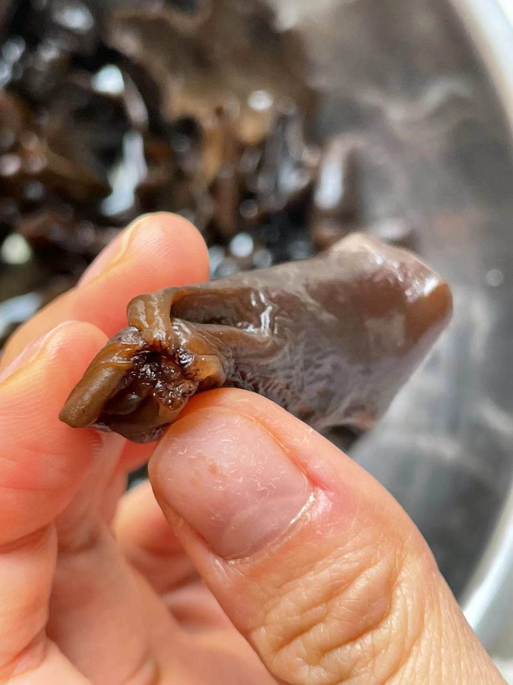
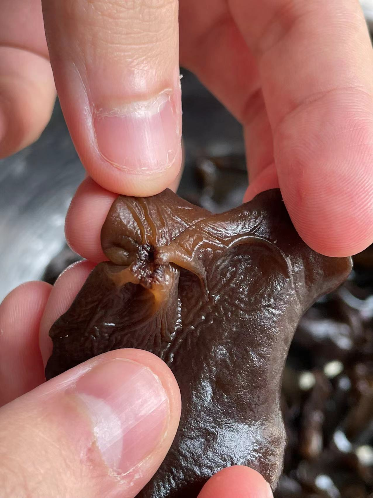
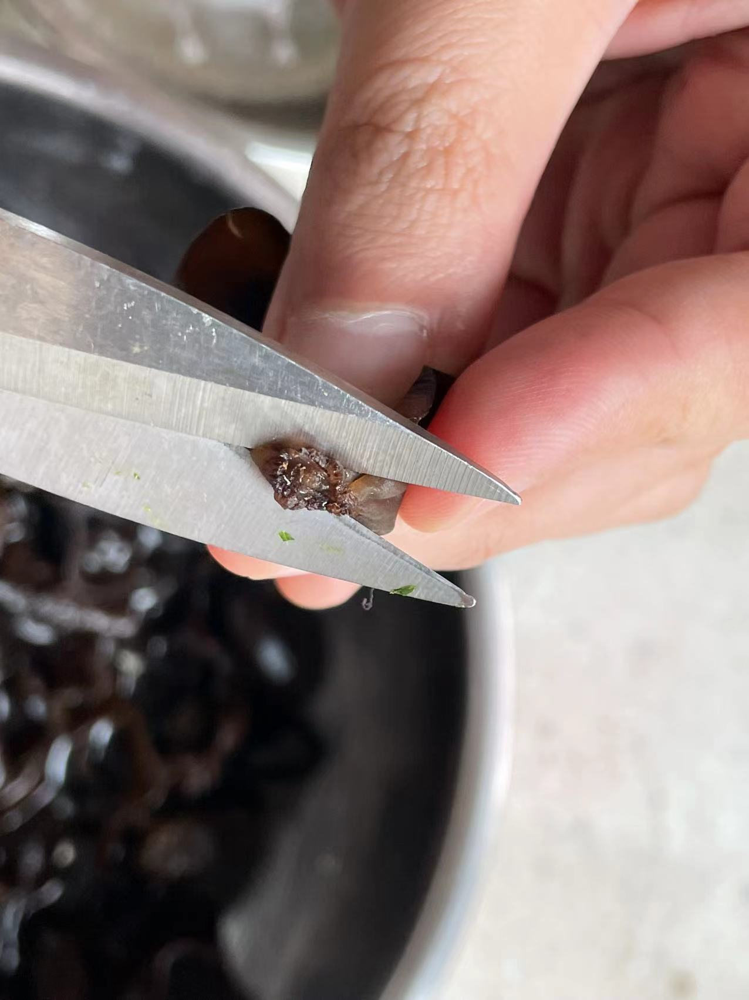
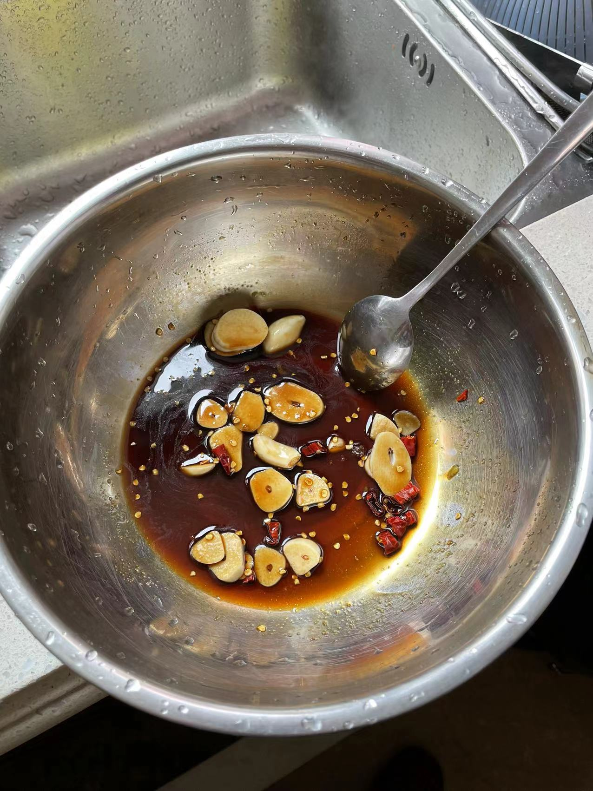
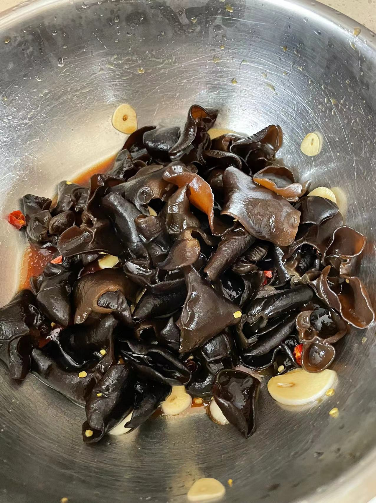

# 凉拌木耳的做法

凉拌木耳，由于发放物资中有很多干货，木耳是较为健康的食物。且凉拌木耳的烹饪方式也相对简单。

预估烹饪难度：★★

## 必备原料和工具

* 干木耳 （湿木耳也可，但不能太久之前泡发的，必须是新鲜的湿木耳）
* 蒜瓣
* 白糖
* 小米辣
* 盐
* 香油
* 生抽
* 醋
* 芥末 （可以不用）

## 计算

每份（1 人量）:

* 干木耳: 20g / 湿木耳: 120g
* 蒜瓣: 2-3 个
* 小米辣: 2 个
* 盐: 2 g
* 糖: 5-10g（依个人口味）
* 生抽: 15ml
* 醋: 15ml
* 香油: 5ml
* 芥末: （约 2cm）

## 操作

* 泡发干木耳, 水量约为 400ml, 泡发约 45 分钟。 （湿木耳跳过此步骤）
* 将泡发好的木耳, 进行去根处理（如图 4, 5, 6）, 并彻底洗净。
* 起锅烧水，水开后放入木耳, 大火煮 1.5-2 分钟。
* 将蒜瓣、小米辣切碎放入碗中 （可选取中大碗）, 并依次加入盐、糖、生抽、醋、香油、芥末, 用量如上。
* 木耳盛出后沥水, 放入上一步碗中。
* 搅拌充分，端盘。

## 附加内容

* 调味品的数量可以根据个人口味进行调整, 如果不喜欢芥末, 可以不加入。
* 等木耳冷却入味后口味更佳, 约 15 分钟。

如果您遵循本指南的制作流程而发现有问题或可以改进的流程，请提出 Issue 或 Pull request 。
