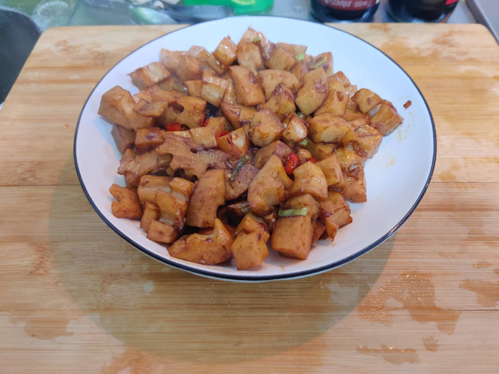

# 小炒藕丁的做法

小炒藕丁是一道简单易做的菜，莲藕营养丰富，非常适合素食。预计制作时长 20 分钟

预估烹饪难度：★★★

## 必备原料和工具

- 大葱
- 小米辣
- 莲藕
- 生抽
- 老抽
- 耗油
- 油

## 计算

每次制作前需要确定计划做几份。一份正好够 2 个人吃。

每份：

- 大葱 1 段
- 小米辣 1-2 根 （看个人吃辣程度）
- 莲藕 1 段
- 生抽 30 ml
- 老抽 15 ml
- 耗油 15 ml
- 食用油 10-15ml

## 操作

- 大葱、小米辣切小段，备用
- 莲藕去皮，切成不超过 3cm 的小块，放入水中备用（防止氧化发黑）
- 取炒锅，锅内放入 500ml 凉水，煮沸
- 将藕丁下入沸水中，焯水 2 分钟后，取出放入盘中备用
- 将锅中水倒掉后，将锅加热干燥，加入 10-15 ml 食用油
- 待油温升高后，下入葱花，小米辣爆香
- 将处理好的藕丁下入锅中，大火翻炒
- 加入生抽、老抽、耗油
- 翻炒 2 分钟即可出锅

## 附加内容

- 食用莲藕要挑选外皮呈黄褐色、肉肥厚而白的。如果发黑，有异味，则不宜食用。
- 请尽量不要使用铁器，会导致莲藕发黑

如果您遵循本指南的制作流程而发现有问题或可以改进的流程，请提出 Issue 或 Pull request 。
