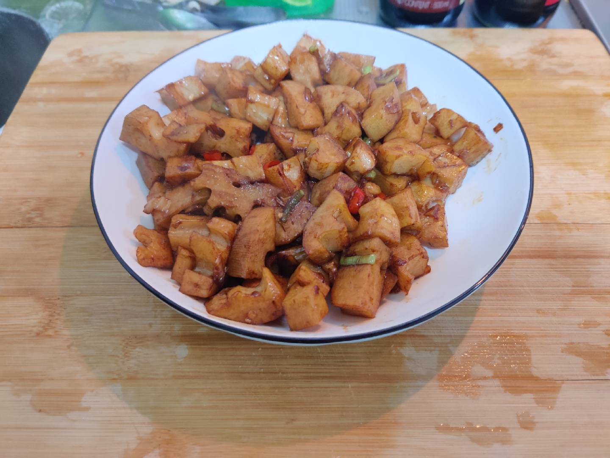

# 小炒藕丁的做法

小炒藕丁是一道快手家常素菜，藕丁脆嫩爽口，咸鲜中带着微微辣意，非常下饭。莲藕富含膳食纤维和维生素，有助于清热润燥。制作简单，只要注意藕丁焯水和调味，厨房新手也能轻松完成。全程大约 20 分钟就能端上餐桌。

预估烹饪难度：★★★

预估卡路里：214 大卡

## 必备原料和工具

- 大葱
- 小米辣
- 莲藕
- 生抽
- 老抽
- 耗油
- 油

## 计算

每次制作前需要确定计划做几份。一份正好够 2 个人吃。

每份：

- 大葱 1 段
- 小米辣 1-2 根 （看个人吃辣程度）
- 莲藕 1 段
- 生抽 30 ml
- 老抽 15 ml
- 耗油 15 ml
- 食用油 10-15ml

## 操作

1. 大葱、小米辣切小段，备用
2. 莲藕去皮，切成不超过 3cm 的小块，放入水中备用（防止氧化发黑）
3. 取炒锅，锅内放入 500ml 凉水，煮沸
4. 将藕丁下入沸水中，焯水 2 分钟后，取出放入盘中备用
5. 将锅中水倒掉后，将锅加热干燥，加入 10-15 ml 食用油
6. 待油温升高后，下入葱花，小米辣爆香
7. 将处理好的藕丁下入锅中，大火翻炒
8. 加入生抽、老抽、耗油
9. 翻炒 2 分钟即可出锅

## 附加内容

- 食用莲藕要挑选外皮呈黄褐色、肉肥厚而白的。如果发黑，有异味，则不宜食用。
- 请尽量不要使用铁器，会导致莲藕发黑

如果您遵循本指南的制作流程而发现有问题或可以改进的流程，请提出 Issue 或 Pull request 。
