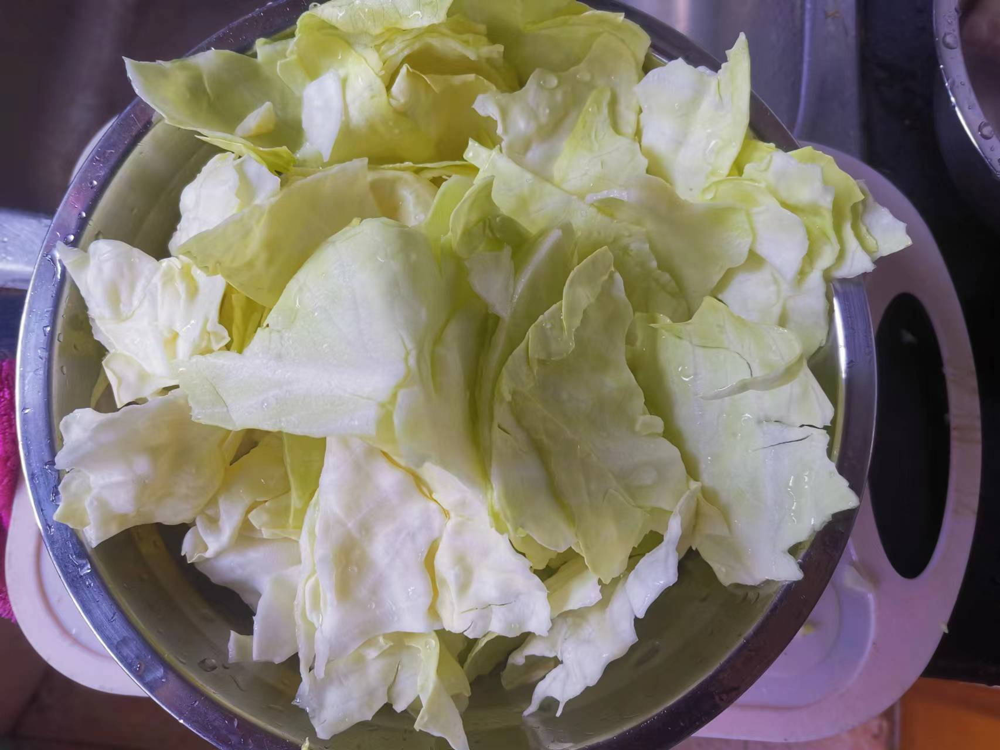
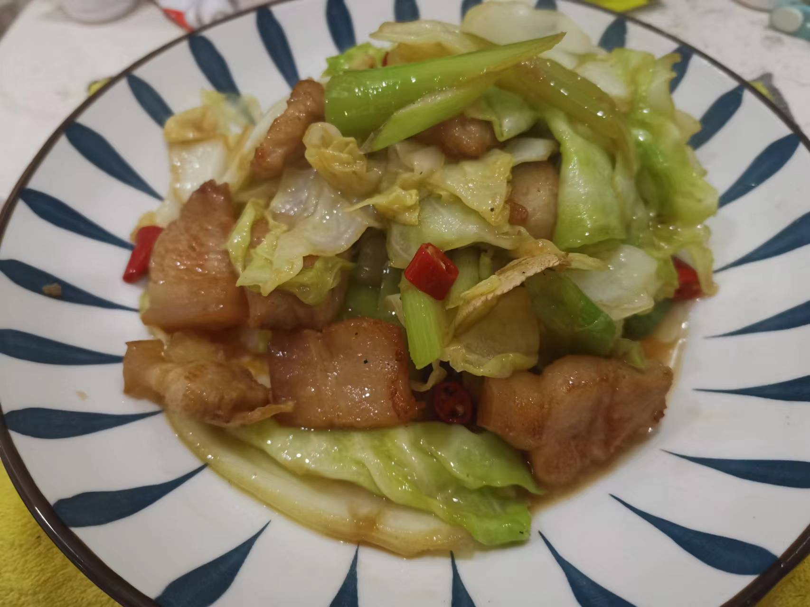

# 手撕包菜的做法

手撕包菜是一道色香味俱全的汉族名菜，属于湘菜系

预估烹饪难度：★★★

## 必备原料和工具

* 包菜
* 五花肉
* 小米辣
* 食用油
* 料酒
* 生抽
* 香醋
* 鸡精
* 姜
* 蒜头
* 蒜苗
* 盐

## 计算

每份：

* 包菜 1 颗
* 五花肉 200 g
* 小米辣 2 根
* 食用油 60 ml
* 料酒 5 ml
* 生抽 5 ml
* 香醋 5 ml
* 鸡精 2 g
* 姜 2 片
* 蒜头 2 粒
* 蒜苗 0.5 根
* 盐 5 g

## 操作

* 包菜对半切开，去掉中间白色部分【参见图一】
* 手撕包菜，碗中放入 2 g 盐，清洗包菜并沥干备用【参见图二】
* 姜片、蒜头、小米辣、蒜苗处理后备用【参见图三】
* 五花肉切片，清水清洗后备用
* 锅中加入 30 ml 食用油，倒入包菜翻炒，大火翻炒 1 分钟 后，加入 3 g 盐 ，继续翻炒 2 分钟 后取出备用
* 锅中加入 30 ml 食用油，倒入五花肉，大火翻炒 1 分钟
* 倒入姜片等材料，翻炒 1 分钟
* 倒入包菜翻炒后，加入 香醋、料酒、鸡精、料酒，大火继续翻炒，2 分钟 后出锅

## 附加内容

* 步骤五中，翻炒时间需要实际情况做调整，一般是炒到包菜七分熟后即可。七分熟是指包菜已经出水质感变软
* 步骤五中，加盐的作用是锁住包菜水分的同时，给包菜上一点味道
* 最后一个步骤中，翻炒时间根据实际情况和个人口感做灵活调整

如果您遵循本指南的制作流程而发现有问题或可以改进的流程，请提出 Issue 或 Pull request 。
