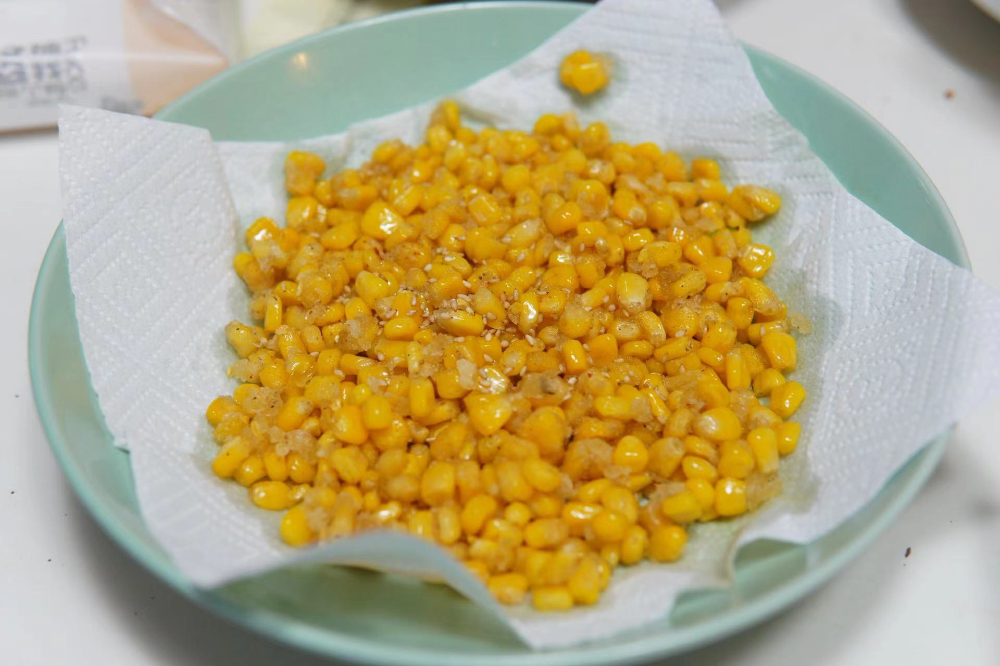

## 椒盐玉米的做法
---
## 原料：

- 玉米粒
- 椒盐
- 芝麻粒
- 油
- 淀粉
---

## 物理道具：

- 两个塑料簸箕
- 若干吸油纸

---

## 速成班：

``` 
玉米粒不要自己剥，费手的，可以直接外卖软件买菜”已经剥好的玉米粒“，30min送达后温水解冻。

开水解冻慢就拿开水煮！（ 千万别煮玉米本身，带着包装一起煮，撕掉一个口
```

---

## 做法：

- 拿出第一个簸箕我们将其假设为BoxA，垫上吸油纸，放进解冻好的玉米粒；
- shaking shaking shaking!
- 拿出第二个簸箕BoxB，垫上吸油纸，将BoxA的玉米粒全部倒入BoxB中；
- shaking shaking shaking!
- repeat 上述操作若干，直到玉米差不多干了；
- 倒入大量淀粉，能够完全盖住玉米粒；
- shaking shaking shaking!
- 开灶 - 放锅 - 倒入油 尽量铺满锅底 但不要太多；
- 等油开，倒入裹上了淀粉的玉米粒；
- 中火先煎30s，不要翻炒，不然淀粉会掉；
- 轻微翻炒即可；
- 出锅！
- 最重要的一步：撒上椒盐，撒上芝麻粒！
- 香喷喷的”椒盐玉米“就做好了

---

## 成品图：
