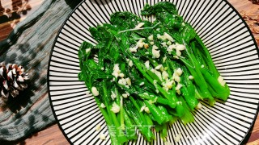

# 白灼菜心的做法

<!-- 标题必须是 `菜名` + `的做法`。和文件名一致。 -->

> 没有拍照，上图是网图，不过做出来都差不多啦

白灼菜心是经典粤菜，白灼是粤菜的一种烹饪技法，用煮沸的水或汤将生的食物烫熟，称为白灼。这种烹饪手法能保持原有的鲜味，粤菜常用此法烹制虾和蔬菜。

总之吧，减肥或者是**快速解决绿叶菜的绝佳方式**。

预估烹饪难度：★★

## 必备原料和工具

- 新鲜菜心
- 生抽、蚝油、盐
- 大蒜、小米辣
- 食用油

## 计算

如下的量两个人够吃，一个人吃直接搭配个米饭也可以的。

- 新鲜菜心 250g
- 食用油 10g
- 调一个灵魂料汁儿
  - 生抽 5g
  - 蚝油 5g
  - 盐、糖 5g
- 大蒜四五瓣、小米辣一两根

## 操作

1. 菜心洗净，**去除根部比较硬或老的地方**。此处还用刀刮了**刮菜心根茎部分**，刮掉外面那层比较硬的，菜心内部更可口，但要注意根茎白灼时长，时间太长的话根茎不脆了

2. 大蒜切成蒜末，有洋葱顺便加了点洋葱

3. 调制灵魂料汁：生抽 5g 吧、蚝油 5g，加 3g 糖和 100g 清水半碗成一碗汁儿
   >如果要是加淀粉，汤汁儿煮沸后更容易挂在菜心上，味道会更重一些，广东人可能吃不惯

4. 一锅 500ml 清水加 5g 盐和 10g 食用油烧开

5. 将菜心根茎在沸水中烫 1 分钟，直到根茎颜色变成深绿。再将整个菜心放到锅中烫熟 1 分钟，捞起来码入盘中

6. 开另一小锅将兑好的料汁倒入，小火烧开，放入一半的蒜末，一点点姜丝和小米椒碎。在制作时加了一点点洋葱碎和大蒜，先在锅底倒油，五成热后倒入蒜末、洋葱，稍稍爆香后再加入料汁，加入小米辣煮开

7. 料汁稍微收汁，煮沸后稍等十来秒吧，后直接浇在菜心上，不要特别多，但蒜末还是很给力的不要少蒜

## 附加内容

- 选择菜心一定要比较新鲜！新鲜！
- 锅内烧清水要加油和盐

如果您遵循本指南的制作流程而发现有问题或可以改进的流程，请提出 Issue 或 Pull request 。
