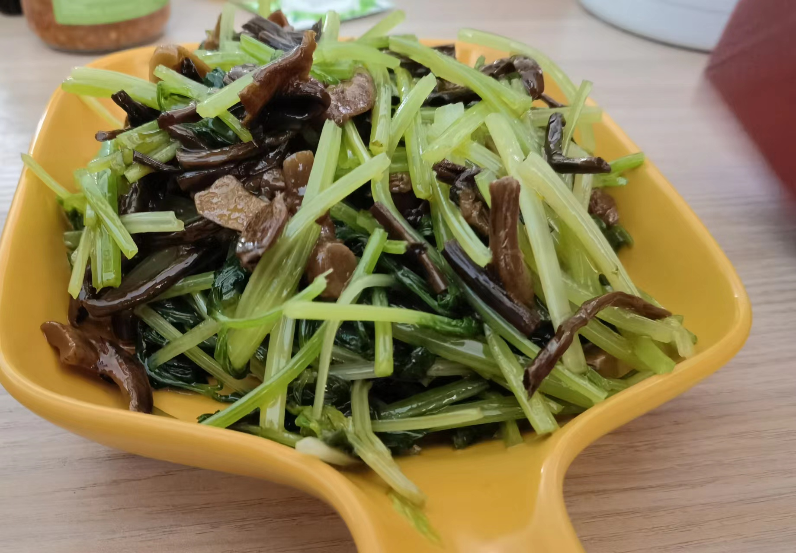
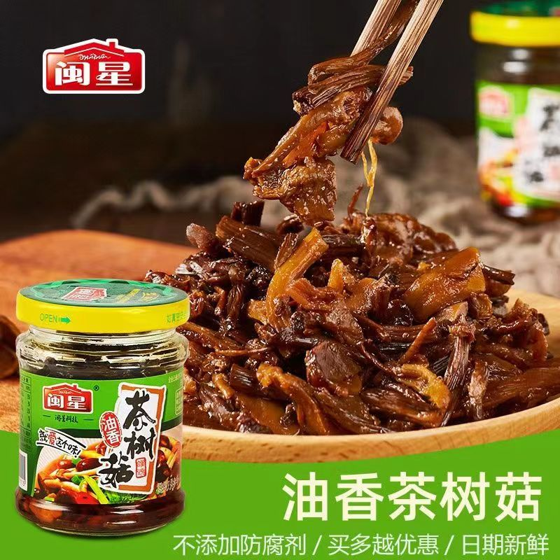

# 芹菜拌茶树菇的做法

芹菜拌茶树菇是一道简单易做的凉拌菜。富含多种人体所需的维生素和矿物质。一般初学者只需要30分钟即可完成。

## 必备原料和工具

- 闽星茶树菇
- 芹菜
- 香油
- 蚝油
- 味极鲜
- 食用盐

## 计算

每次制作前需要确定计划做几份。一份可够1-2人。

每份：

- 闽星茶树菇 1瓶
- 芹菜 250-300g(推荐30cm高的芹菜苗,没有芹菜苗可以用山芹或芹菜代替但是需要稍微焯水断生)
- 香油 5ml
- 蚝油 7ml左右
- 味极鲜 3ml
- 食用盐 2g左右

## 操作

- (如果是芹菜苗这一步略过)用热水壶烧一壶热水,备用
- 新鲜的芹菜苗或者芹菜摘去黄叶清洗,备用
- (如果是芹菜苗这一步略过)将芹菜摘去叶子单独放一个盆中,将芹菜茎用刀划成2-3毫米宽的芹菜条备用,这一步的目的是让芹菜断生的更快更均匀,吃起来更脆更爽口
- 芹菜苗切成4cm的芹菜段,备用
- (如果是芹菜苗这一步略过)起锅开火,将热水壶的开水倒入锅中待水起泡沸腾
- (如果是芹菜苗这一步略过)将切好的芹菜条放入锅中焯水,20秒左右放入芹菜叶,5秒后关火全部捞出过凉水,备用
- 将盆中焯好的芹菜或者芹菜苗撒上准备好的食盐,香油,耗油和味极鲜搅拌均匀
- 将茶树菇倒入盆中搅拌均匀
- 装盘
- 开吃

## 附加内容

- 焯水时的水位需要没过芹菜
- 芹菜叶太老太硬的话可以不要

如果您遵循本指南的制作流程而发现有问题或可以改进的流程,请提出 Issue 或 Pull request 。

