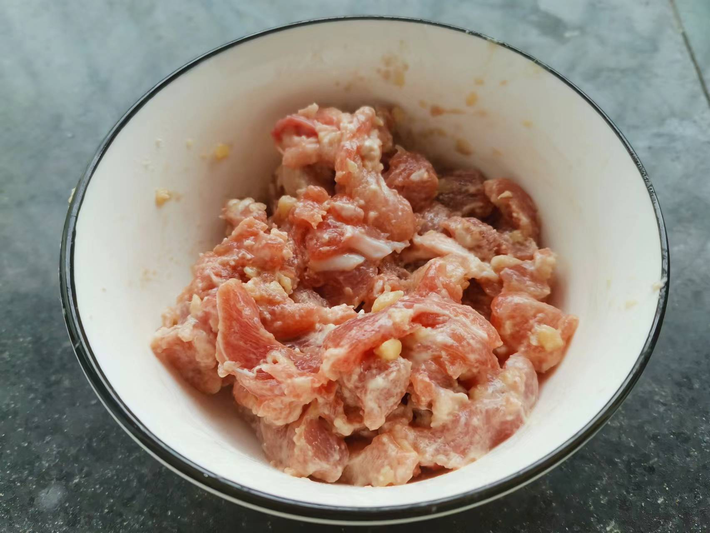
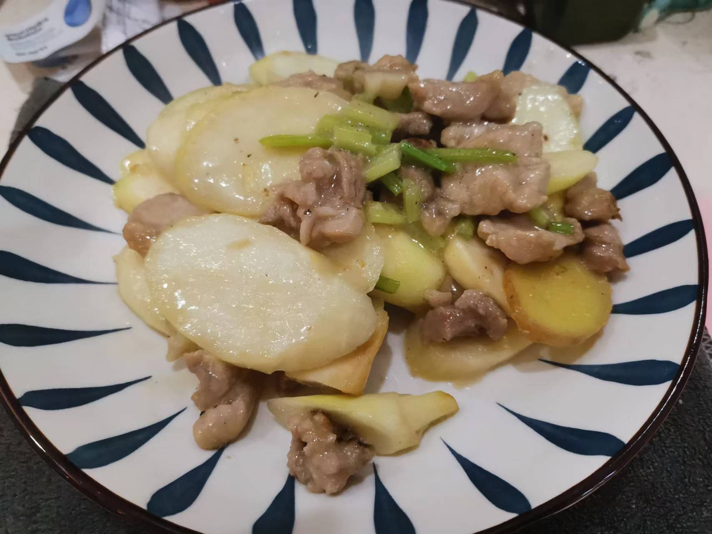

# 茭白炒肉的做法

茭白味道鲜美，有一定营养价值

预估烹饪难度：★★★

## 必备原料和工具

* 茭白
* 瘦肉
* 淀粉
* 食用油
* 鸡精
* 姜
* 蒜
* 料酒
* 盐

## 计算

每份：

* 茭白 2 根
* 瘦肉 100 g
* 淀粉 15 g
* 食用油 30 ml
* 鸡精 5 g
* 姜 1 片
* 蒜 1 个
* 料酒 5 ml
* 盐 2 g

## 操作

### 准备

* 茭白切片，每片厚度 0.5 cm
* 瘦肉切条，厚度 0.3-0.5 cm，加入料酒、生粉、盐、水搅拌
* 姜切片、蒜头剁碎

### 制作

* 起锅水烧开，放入茭白，水煮 60-90 S 后取出沥干
* 起锅，倒入 15 ml 油，倒入瘦肉，反复翻炒 60 S 取出
* 起锅，倒入 15 ml 油，倒入姜、蒜翻炒 30S，加入茭白继续翻炒 30 S
* 继续加入瘦肉翻炒 60 S，加入 20 ml 水，加入盐、鸡精后翻炒 60S 出锅

## 附加内容

* 最后一个步骤，可以考虑加蚝油、生抽代替盐上色

如果您遵循本指南的制作流程而发现有问题或可以改进的流程，请提出 Issue 或 Pull request 。
