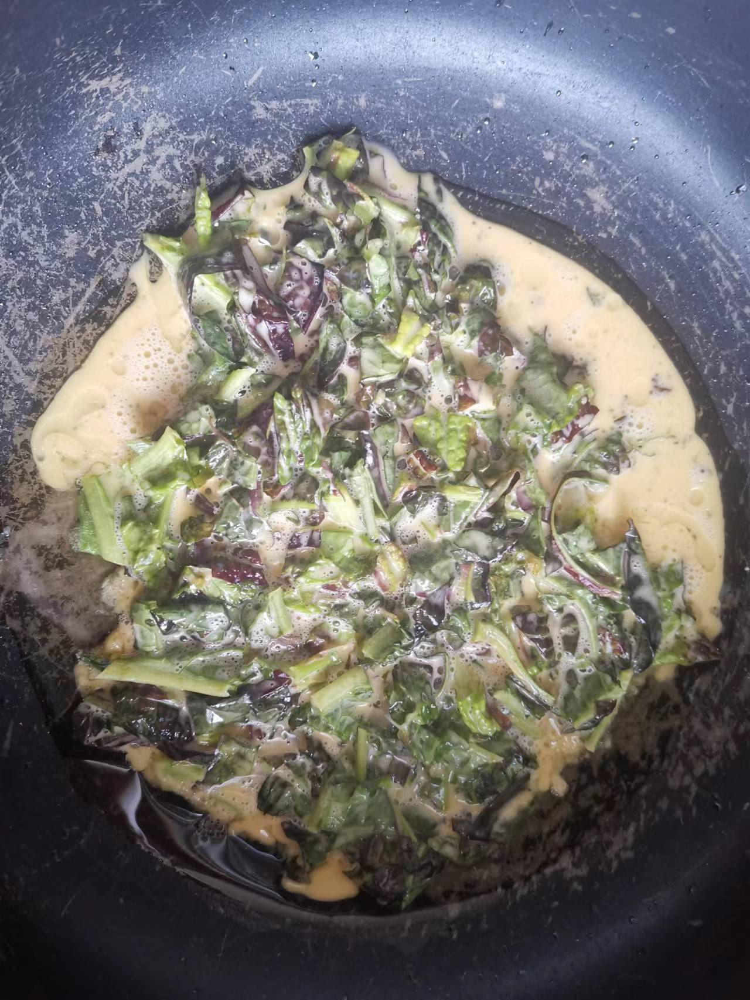

# 莴笋叶煎饼的做法

莴笋叶煎饼营养、好吃

预估烹饪难度：★★

## 必备原料和工具

* 莴笋叶
* 鸡蛋
* 食用油
* 生抽
* 淀粉
* 鸡精

## 计算

每份：

* 莴笋叶 50 g
* 鸡蛋 2 个
* 食用油 30 ml
* 生抽 5 ml
* 淀粉 15 g
* 鸡精 2 g

## 操作

* 莴笋叶剁碎，加入鸡蛋、生粉、生抽、鸡精搅拌均匀备用
* 起锅烧油，倒入莴笋叶浆汁，均匀平铺在锅面上
* 第一面炸 120 S 后，翻面再炸 60 S 后出锅

## 附加内容

* 选择莴笋叶是某省市买到的蔬菜包基本都包含莴笋，可以换成韭菜等
* 莴笋叶直接焯水后凉拌有苦味，所以选择做成煎饼的配菜

如果您遵循本指南的制作流程而发现有问题或可以改进的流程，请提出 Issue 或 Pull request 。
