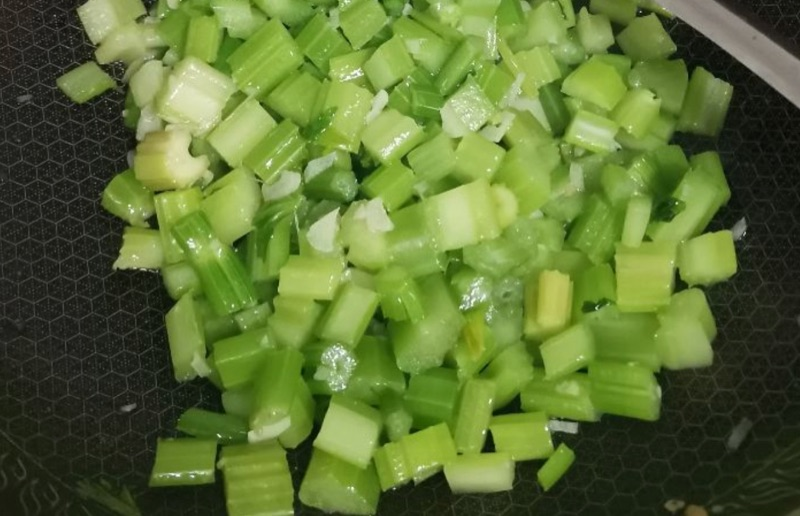

# 蒜蓉炒芹菜的做法

蒜蓉炒芹菜是一道清脆爽口、蒜香浓郁的家常快手素菜。芹菜富含膳食纤维、维生素 K 和钾元素。这道菜的灵魂在于「脆」——大火快炒半分钟即出锅，口感脆生生的，一口咬下去还有汁水。从备料到出锅大约只需 10 分钟。

预估烹饪难度：★★

预估卡路里：150 大卡

## 必备原料和工具

* 芹菜（香芹最佳）
* 猪油（没有可用食用油替代，但猪油风味更佳）
* 蒜
* 盐

## 计算

每份：

* 香芹 300 g（约 2 大把）
* 蒜 4 瓣，切末
* 猪油 15 ml
* 盐 2 g

## 操作

1. 芹菜摘去大部分叶子，只保留少量嫩叶。如果梗部较粗，纵向剖开一刀使其粗细一致，然后切成不超过 5 cm 的段（约大拇指长度，太长容易卡嗓子）
2. 蒜切成蒜末，备用
3. 芹菜段入锅前尽可能沥干水分，甩得越干越好
4. 炒锅烧热，放入 15 ml 猪油，油热后先撒入 2 g 盐
5. 放入蒜末，小火炒 10 秒煸香
6. **转大火**，倒入芹菜段，快速翻炒 **30 秒**，立即出锅
7. 出锅标准：芹菜看起来**半生不熟**、颜色翠绿、没有炒软塌，这时的口感最脆

## 附加内容

* 芹菜选香芹（细梗品种）最佳，口感最脆嫩。普通芹菜也可以，但梗粗的需要纵向切细
* **大火快炒是关键**，芹菜下锅到出锅不超过 1 分钟。炒久了会变软变蔫，失去脆生的口感
* 芹菜下锅前一定要尽量沥干水，水分太多会降低锅温，导致变成「煮」而不是「炒」
* 用猪油炒比食用油更香，如果没有猪油，食用油也可替代

如果您遵循本指南的制作流程而发现有问题或可以改进的流程，请提出 Issue 或 Pull request 。
