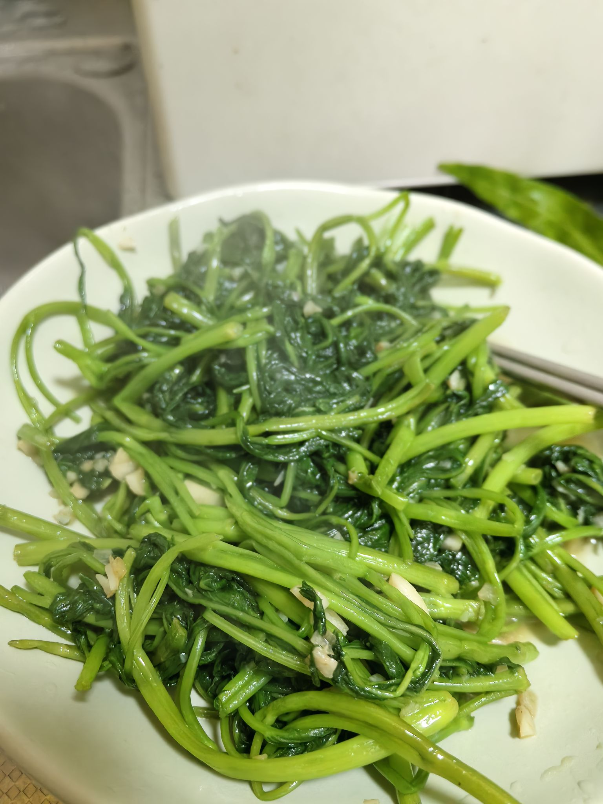

# 蒜蓉空心菜的做法

背景：

曾经去学校附近的川菜馆吃过蒜蓉空心菜，之后就一直很喜欢吃。

预估烹饪难度：★★

## 必备原料和工具

* 空心菜
* 蒜末
* 盐
* 生抽
* 筷子
* 铲子

## 计算

每份：

* 新鲜空心菜 250 g
* 大蒜半个，切碎为蒜末
* 食用油 45 ml
* 盐 2 g
* 白糖 3 g
* 生抽 8 ml

## 操作

* 空心菜洗净，去掉烂叶或者老梗，均匀切成 2 段或者 3 段（防止过长不好炒）
* 锅里先倒少量油，烧至微微冒烟，此时拿起锅将国内的热油向四周浸润，让油均匀覆盖锅底，然后再倒入剩余的油([热锅凉油法](https://cook.aiursoft.com/tips/learn/%E5%AD%A6%E4%B9%A0%E7%82%92%E4%B8%8E%E7%85%8E/?h=%E7%83%AD%E9%94%85#_5))。
* 放入蒜末，小火炒 10 到 15 秒煸香
* 尽快均匀地放入空心菜，**开大火**，左手拿铲子，右手拿筷子，配合将空心菜不停翻动，**直至软化变绿**。
* 接着不需使用筷子，而是使用铲子快速翻炒已软化的空心菜 15 - 20 秒，使之受热更均匀，撒入盐 2 g ，白糖 3 g，生抽 8 ml。
* 继续大火翻炒 10 秒，即可出锅。

## 附加内容

* 空心菜尽量选择新鲜，鲜嫩的，否则炒出来口感可能会比较老
* 实际放入空心菜的量可以根据锅的大小决定，建议不超过一个锅，否则太多的话开始的翻动阶段和后续的翻炒，容易掉出少量空心菜到灶台
* 炒空心菜时，一定要**开大火**，这样空心菜才能快速变软的同时保持脆嫩的口感，大火也有利于炒出生抽的香味。

如果您遵循本指南的制作流程而发现有问题或可以改进的流程，请提出 Issue 或 Pull request 。
