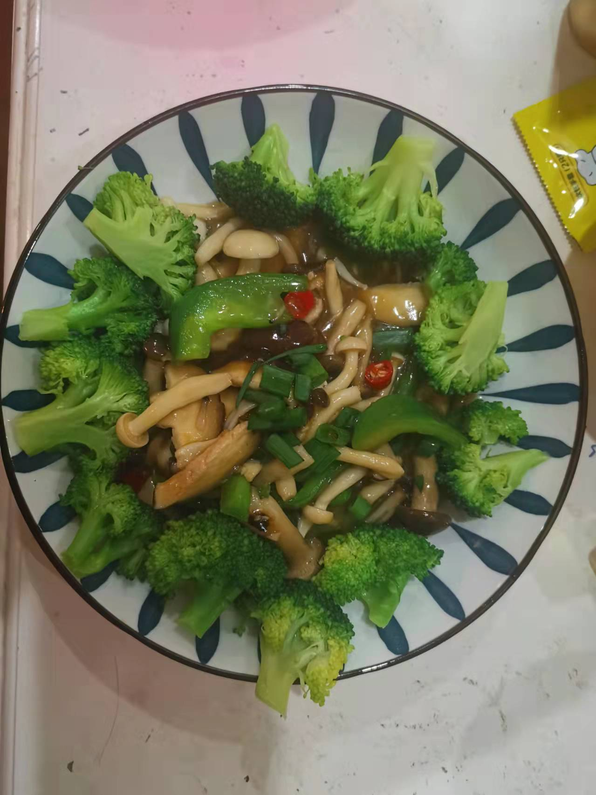

# 蚝油三鲜菇的做法

几分钟就能做出的蚝油蘑菇，滑嫩入味鲜美可口，别提多好吃了。

预估烹饪难度：★★★

## 必备原料和工具

* 香菇
* 蟹味菇
* 白玉菇
* 小米辣
* 菜椒
* 食用油
* 盐
* 料酒
* 淀粉
* 生抽
* 鸡精
* 香葱
* 姜末
* 蚝油
* 西蓝花

## 计算

每份：

* 鲜香菇 2 朵
* 蟹味菇 30 g
* 白玉菇 30 g
* 小米辣 1 根
* 菜椒 0.5 颗
* 食用油 10 ml
* 食用盐 5 g
* 料酒 2 ml
* 淀粉 10 g
* 生抽 10 ml
* 鸡精 3 g
* 香葱 0.5 根
* 姜末 1 粒
* 蚝油 5 ml
* 开水 350 ml
* 西蓝花 100 g

## 操作

* 蟹味菇、白玉菇 去掉根部泥土，掰散菌朵
* 香菇切片（每片厚度 0.5-1 cm，厚点相对薄点更有嚼劲）
* 生粉倒入小碗中，加入 50ml 水，搅拌生粉直至融化没有颗粒（即水淀粉）备用
* 水开，放入西蓝花，清水煮 3 分钟，放入碗中备用
* 洗锅烧开水，加入 5 g 食用盐，倒入蟹味菇、白玉菇、香菇，水煮 1 分钟
* 1 分钟后，捞出沥干水分
* 起锅烧油，待油开始冒小泡，放入姜末、小米辣、菜椒 煸炒 30 S
* 倒入三鲜菇，然后依次倒入生抽、蚝油、鸡精，翻炒均匀后，倒入水淀粉
* 中火烧干汁，加入料酒、葱花 出锅
* 摆上西蓝花

## 附加内容

如果您遵循本指南的制作流程而发现有问题或可以改进的流程，请提出 Issue 或 Pull request 。
