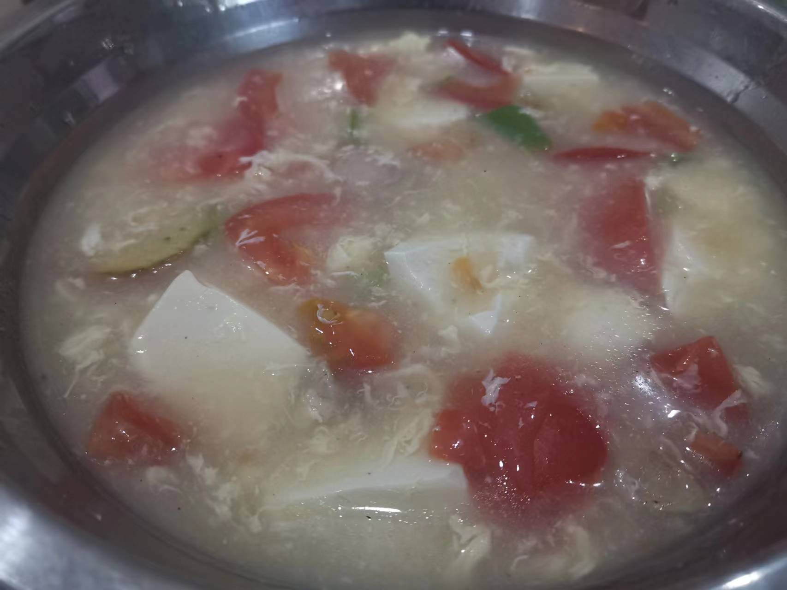

# 西红柿豆腐汤羹的做法

西红柿豆腐汤羹是一道很清淡美味的汤羹

预估烹饪难度：★★

## 必备原料和工具

* 西红柿
* 鸡蛋
* 豆腐
* 食用油
* 盐
* 淀粉
* 鸡精
* 香葱
* 姜
* 开水

## 计算

每份：

* 西红柿 1 个
* 鸡蛋 1 个
* 豆腐 100 g
* 食用油 5 ml
* 盐 2 g
* 淀粉 5 g
* 鸡精 2 g
* 香葱 0.5 根
* 姜 1 片
* 开水 350 ml

## 操作

* 西红柿切成小丁、鸡蛋打入碗中搅拌、豆腐切块备用
* 起锅烧油，放入姜片 5 S 后倒入入西红柿翻炒 30 S
* 锅中加入开水，汤水烧开，60 S 后到入鸡蛋液、豆腐块
* 汤水重新烧开后，加入水淀粉，沿一个方向搅拌 2 圈
* 加入鸡精、盐、香葱，30 S 后起锅

## 附加内容

如果您遵循本指南的制作流程而发现有问题或可以改进的流程，请提出 Issue 或 Pull request 。
