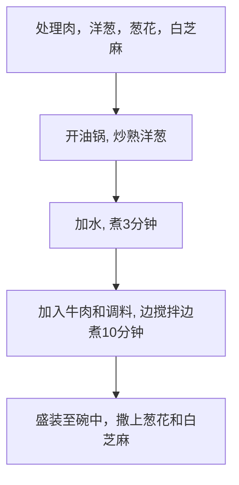

# 日式肥牛丼饭的做法

预估烹饪难度：★★★★

## 必备原料和工具

### 主食材

- 洋葱（务必选用外皮为白黄色的洋葱，不要用紫色的洋葱）
- 肥牛（火锅肥牛即可，也可选用原切肥牛片）
- 葱（也可选用切好的葱段）
- 白芝麻
- 味淋（一种常用日式调料，可在各大电商平台购买，也可用料酒代替）

### 副食材

额外用作点缀的食材，可选

- [温泉蛋](../../breakfast/温泉蛋/温泉蛋.md)
- 出汁（使用柴鱼干和昆布熬制的汤汁，可以用于提鲜）

## 计算

食材用量与米饭成正比，计算部分以 **一杯米(160ml)** 为例。约为二人食用分量，吃不完可以放冰箱冷藏，但可能会没那么好吃

- 洋葱 1 个
- 肥牛 250 克
- 葱 1~2 根
- 白芝麻 5 克

## 操作

### 1. 食材准备

- 洋葱剥去外层去芯，切成月牙状
- 葱洗净切成 0.5cm 的小段
- 热锅直接放入白芝麻，**前后晃动锅体**使芝麻均匀受热至*略呈金黄色*
- 肥牛焯水 1 分钟后捞出
- 将 40g `味淋`（或 30g `料酒`），30g `酱油`，20g `耗油`，5g `糖`，5g `老抽`（可选，用于调色），在碗中搅拌混合成`调料`（该步骤可直接将碗放在电子秤上进行）

### 2. 烧煮过程

- 热油锅放入洋葱，**快速翻炒**至洋葱*变透明状*
- 关小火，加入 250g 水（或出汁），开回大火加热**等待 3 分钟**
- 加入牛肉和`调料`
- **不断翻动**所有食材 **10 分钟**，防止食材粘锅
- 关火
- 盛装肥牛丼至[米饭](../米饭/电饭煲蒸米饭.md)上（注意要把汁水淋一些在饭上）
- 撒上葱花和白芝麻，制作完成。

### 3.冷藏后加热

冷藏的牛丼每次取出需要吃的份量，加热后盖在[米饭](../米饭/电饭煲蒸米饭.md)上。

- 微波炉：单人份高火 2-3 分钟
- 锅：需额外加 50ml 水，加热时需**不断翻动**

## 附加内容

```shell
struct Staple{float 咸度;};
struct Staple 牛丼
牛丼.咸度 = 尝一口汤汁;
while(牛丼.咸度 < 预期) 加入(1 g)酱油; 牛丼.咸度 = 尝一口汤汁;
```

### 备注说明

- 如果用的是比较不错的牛肉，可以选择不焯水，能够更加保留牛肉的风味，因为加入了味淋所以不会很腥，无需担心牛肉不熟，加热 10 分钟肯定熟了
- 如果有条件，选择加入 15g`清酒`

### 流程图解



### 成品


### 参考资料

- [河水洋洋实验室 【牛丼｜肥牛饭】吉野家牛肉饭的正宗做法](https://www.bilibili.com/video/BV1rK4y1d7Fk)
- [夏叔厨房 60秒搞定神仙配方，好吃又下饭的肥牛饭！](https://www.bilibili.com/video/BV1xu4y1676X)

---
如果您遵循本指南的制作流程而发现有问题或可以改进的流程，请提出 Issue 或 Pull request 。
